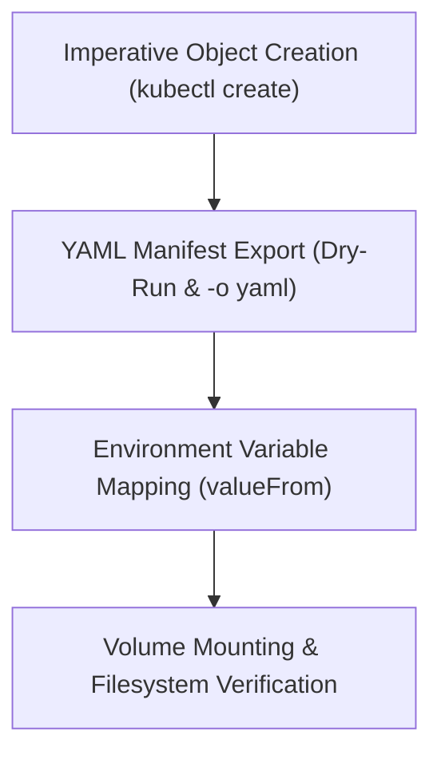

# Module 8-17: ConfigMaps & Secrets Lab

This module covers hands-on workflows for creating ConfigMaps and Secrets imperatively, exporting manifests to YAML, and injecting variables and file mounts.

---

## 🗺️ Cognitive Map: How to Think About the Flow of Knowledge

To build a strong intuition for this domain, think of the topics as moving from foundational primitives to advanced implementations:



1. **Step 1: Imperative Creation (Section 1):** Creating configurations quickly using CLI commands.
2. **Step 2: Manifest Exporting (Section 2):** Converting imperative commands into version-controlled YAML files.
3. **Step 3: Variables & Volume Mounts (Section 3):** Injecting configuration data into containers.

By following this flow, you progress from **CLI Creation → YAML Manifesting → Container Runtime Injection**.

---

## 1. Imperative Configuration Workflows

* **ConfigMaps:** Creating ConfigMaps imperatively is often faster than writing YAML manifests from scratch:
  ```bash
  kubectl create configmap app-config --from-literal=LOG_LEVEL="INFO" --from-literal=DATABASE_URL="mysql://db:3306"
  ```
* **Secrets:** Imperative commands handle the base64 encoding automatically, saving manual configuration steps:
  ```bash
  kubectl create secret generic app-secret --from-literal=DB_PASSWORD="super-secret-password"
  ```

---

## 2. Exporting to Version Control

To store configurations in version control, export the live cluster settings to a YAML manifest:
```bash
kubectl get configmap app-config -o yaml > app-config.yaml
```
This retrieves the resource schema from the API server and saves it locally.

---

## 3. Environment and Volume Injection

### A. Environment Variable Mapping
Map specific ConfigMap keys to container environment variables:
```yaml
env:
  - name: DATABASE_URL
    valueFrom:
      configMapKeyRef:
        name: app-config
        key: DATABASE_URL
```
* `name`: The environment variable name inside the container.
* `key`: The source key inside the ConfigMap.

### B. Mounting Configuration Volumes
Mount the ConfigMap to a directory path such as `/etc/config`. The container filesystem will create a file for each key, with the key's value as the file content.
* **Security & Decryption:** Organizations may mount encrypted files as volumes and rely on decryption tools running inside the container to decrypt the configuration at runtime.
