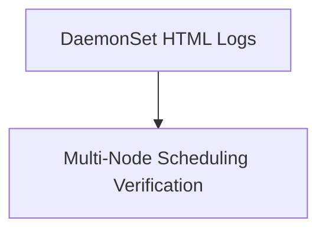

# Module 8-19: DaemonSet Lab Walkthrough

This module covers hands-on configurations and log verification for DaemonSets running across multiple worker nodes.

---

## 🗺️ Cognitive Map: How to Think About the Flow of Knowledge

To build a strong intuition for this lab, follow the visual walkthrough and practical steps:

1. **Step 1: Lab Resources (Section 1):** Access the interactive logs and YAML examples for the DaemonSet lab.

---

## 1. Lab Resources

* **Interactive Lab HTML Logs:** [../Attachments/daemonsets.html](../Attachments/daemonsets.html) (embed: `![[../Attachments/daemonsets.html]]`)
