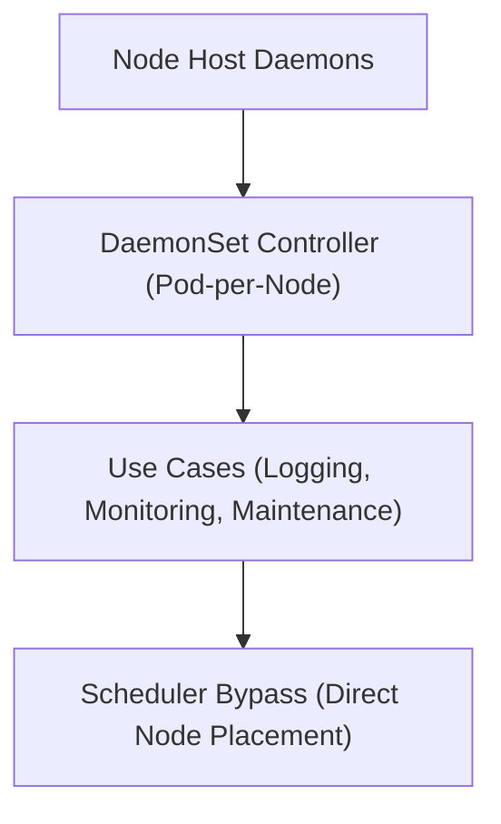

# Module 8-18: DaemonSets Configurations

This module covers the DaemonSet controller, detailing how it schedules a pod copy on every worker node and how it can bypass the scheduler for host-level tasks.

---

## 🗺️ Cognitive Map: How to Think About the Flow of Knowledge

To build a strong intuition for this domain, think of the topics as moving from foundational primitives to advanced implementations:

1. **Step 1: Architecture (Section 1):** Understanding DaemonSet scaling rules (one Pod per node).
2. **Step 2: Use Cases (Section 2):** Implementing logging, monitoring, and file-system mounting.
3. **Step 3: Node Selection (Section 3):** Bypassing the scheduler to run on targeted nodes.

By following this flow, you progress from **Node Scaling → Workload Use Cases → Node Selection Control**.

---

## 1. DaemonSet Architecture

* A **DaemonSet** ensures that all (or subset of) worker nodes run a single copy of a specified Pod.
* When new worker nodes are added to the cluster, the DaemonSet controller automatically spins up a Pod on them. When nodes are removed, the Pods are garbage collected.

---

## 2. Common DaemonSet Use Cases

DaemonSets are ideal for node-level background utilities:
* **Log Aggregation:** Running a log collector (e.g., Fluentd, Logstash) on every node to stream host and container logs.
* **Node Monitoring:** Running monitoring agents (e.g., Prometheus Node Exporter, Datadog Agent) to collect node performance metrics.
* **Storage Daemons:** Running storage daemons (e.g., Ceph, GlusterFS) to provide persistent volumes to the cluster.

---

## 3. Scheduler Bypass

In some configurations, you can bypass the default scheduler entirely by specifying node selectors or affinity rules. This allows DaemonSet Pods to deploy directly to designated nodes even if the scheduler is overloaded or unavailable.

### Architecture Layout
![[Pasted image 20250524164538.png]]
