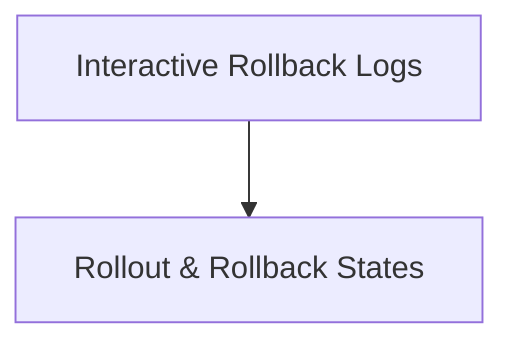

# Module 8-14: Advanced Deployment Lab 2

This module covers the interactive analysis of rollout histories and rollback mechanisms in complex deployment scenarios.

---

## 🗺️ Cognitive Map: How to Think About the Flow of Knowledge

To build a strong intuition for this lab, follow the visual walkthrough and practical steps:

1. **Step 1: Rollout & Rollback Logs (Section 1):** Analyze the interactive logs capturing rolling updates and rollbacks.

---

## 1. Rollout and Rollback Logs

* **Interactive Lab HTML Logs:** [rolling+out+and+rolling+back.html](rolling+out+and+rolling+back.html) (embed: `![[rolling+out+and+rolling+back.html]]`)
