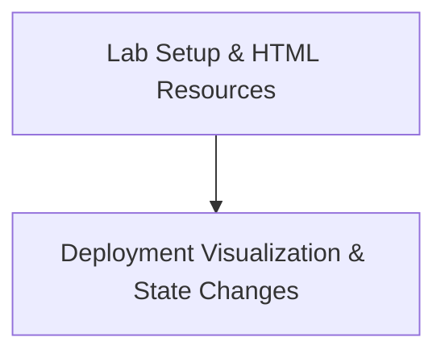

# Module 8-13: Deployment Lab Walkthrough

This module covers the hands-on practice of deploying, updating, and rolling back applications in Kubernetes using Deployments.

---

## 🗺️ Cognitive Map: How to Think About the Flow of Knowledge

To build a strong intuition for this lab, follow the visual walkthrough and practical steps:

1. **Step 1: Lab Resources (Section 1):** Access the interactive HTML logs for the lab.
2. **Step 2: State Visualization (Section 2):** Analyze the visual state transitions during the deployment rollout.

---

## 1. Lab Resources & Interactive Logs

* **Interactive Lab HTML Logs:** [deployments.html](../../Attachments/deployments.html) (embed: `![[../../Attachments/deployments.html]]`)

---

## 2. Deployment State Visualization

* **Rollout State Diagram:**
  ![[Pasted image 20250425112102.png]]
