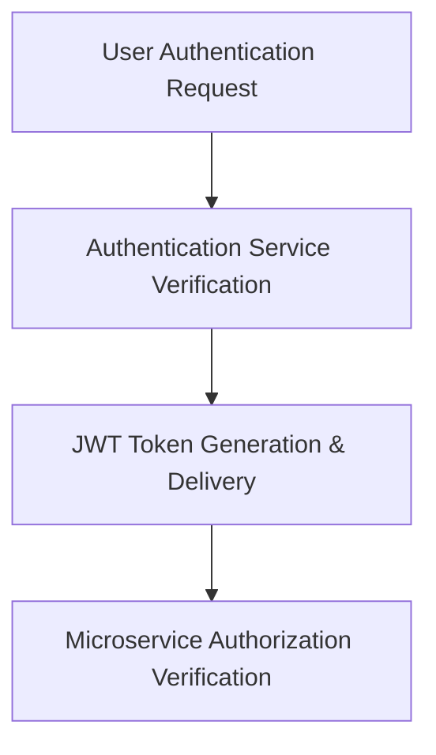

# Module 8-41: Kubernetes Final Project Playbook

This module covers the design and token-based authorization flow of the final microservices project.

---

## 🗺️ Cognitive Map: How to Think About the Flow of Knowledge

To build a strong intuition for this playbook, follow the security architecture:

1. **Step 1: Architecture (Section 1):** Mapping out the authentication service nodes.
2. **Step 2: Authorization Flow (Section 2):** Utilizing JSON Web Tokens (JWT) to authorize requests across microservices.

---

## 1. Project Architecture

The final project implements a decoupled microservices architecture. A central authentication service handles credential validation and security mappings:
* **Lab Resources:**
  * **Architecture Mappings:** [auth-service-resources.html](auth-service-resources.html) (embed: `![[auth-service-resources.html]]`)

---

## 2. JWT-Based Authentication Flow

To secure communications between services:
1. The user logs in via the authentication service.
2. The authentication service generates a signed JSON Web Token (JWT).
3. The user passes this JWT in the HTTP authorization headers of all subsequent requests.
4. Internal microservices decode and validate the token signature to authorize access without re-querying the authentication database.
