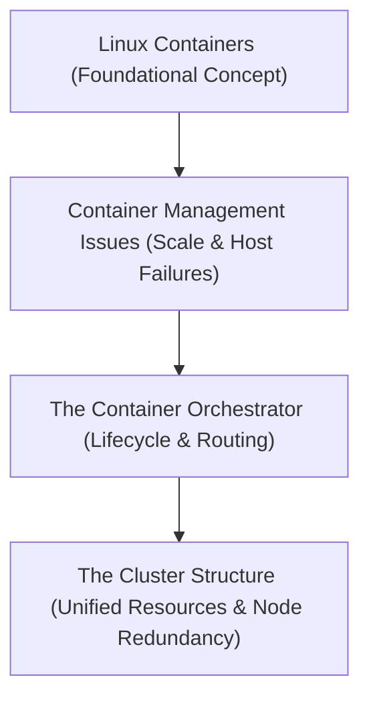

# Module 8-1: Kubernetes Idea & Architecture

This module covers the core concepts of container orchestration, comparing the limitations of standalone containers and simple orchestrators with the capabilities of a Kubernetes cluster.

---

## 🗺️ Cognitive Map: How to Think About the Flow of Knowledge

To build a strong intuition for this domain, think of the topics as moving from foundational primitives to advanced implementations:

1. **Step 1: Container Foundations (Section 1):** Realizing that understanding Linux containers is essential before learning container orchestration.
2. **Step 2: Orchestration Challenges (Section 2):** Identifying the issues that arise when scaling and distributing containers across multiple nodes (traffic routing, health management).
3. **Step 3: The Orchestrator & Cluster (Section 3):** Understanding how Kubernetes acts as both an orchestrator (lifecycle manager) and a cluster (aggregated compute resources).

By following this flow, you progress from **Isolated Containers → Orchestration Requirements → Cluster Aggregation**.

---

## 1. Container Foundations

* Learning Kubernetes does not strictly require deep expertise in Docker itself, but it does require a solid understanding of **Linux Containers** and kernel-level namespaces/cgroups.
* Hosting a multi-tier application (e.g., UI, Backend, Database) in standalone containers presents severe reliability challenges. If a container crashes, it must be restarted. If the host machine itself crashes, another node must take over.

---

## 2. The Need for Orchestration

When distributing containers across multiple physical or virtual machines to protect against host failure, several complex infrastructure challenges arise:
* **Container-to-Container Communication:** How do containers resolve each other's network locations when spread across different nodes?
* **External Access:** How is incoming external user traffic routed efficiently to the correct container?
* **Failover and Recovery:** How are replacements scheduled if a host goes offline?

To solve these network and lifecycle challenges, a container **orchestrator** is required.
* **Docker Swarm:** A lightweight orchestrator that is simple to run but struggles to manage very large-scale configurations.
* **Kubernetes:** A highly mature, open-source orchestration system developed by Google based on years of internal engineering experience (derived from Borg).

---

## 3. Clusters and Nodes

Kubernetes functions as both an orchestrator and a cluster:
* **Orchestrator:** A control agent that manages container runtime states, handles container starts/stops, monitors node health, and configures the virtual networks between containers.
* **Cluster:** A collection of physical or virtual machines (nodes) that pool their compute, memory, and storage resources together so they can be consumed as a single unified resource.
  * **Node:** An individual host machine in the cluster.
  * **Redundancy:** If a node crashes, the other nodes complement the resource deficiency.
  * **Horizontal Scaling (Scale Out/In):** Adding or removing nodes to dynamically adjust cluster resource capacity.
  * **Vertical Scaling:** Increasing or decreasing the CPU/Memory resources allocated to a specific node or container.
