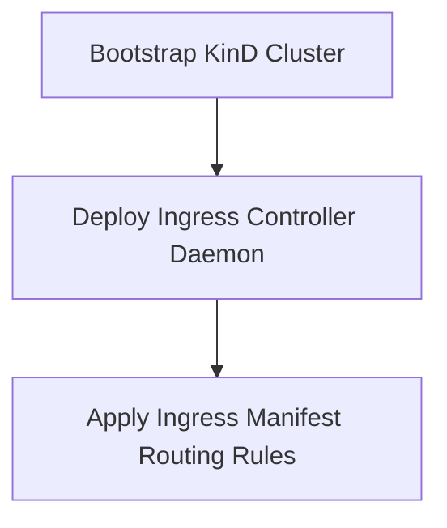

# Module 8-30: Ingress Lab 1 Walkthrough

This module covers local cluster configuration and Ingress Controller deployments using KinD (Kubernetes in Docker).

---

## 🗺️ Cognitive Map: How to Think About the Flow of Knowledge

To build a strong intuition for this lab, analyze the setup steps:

1. **Step 1: Cluster Setup (Section 1):** Deploying a KinD cluster configured for ingress port mapping.
2. **Step 2: Controller Deployment (Section 2):** Deploying the Nginx Ingress Controller.

---

## 1. Lab Setup and KinD Configuration

KinD (Kubernetes in Docker) allows running local multi-node clusters that simulate ingress controllers. To use Ingress in KinD, you must bootstrap the cluster with custom port mappings (ports `80` and `443` mapped from the host to the KinD node).

---

## 2. Interactive Lab Logs

* **Interactive Lab HTML Logs:** [resources_lab01.html](../Attachments/resources_lab01.html) (embed: `![[../Attachments/resources_lab01.html]]`)
