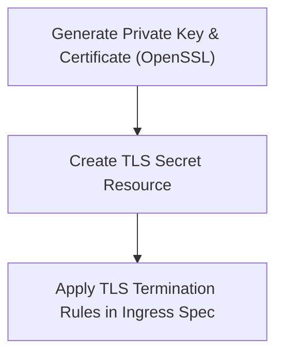

# Module 8-31: Ingress Lab 2 Walkthrough

This module covers SSL/TLS termination inside an Ingress controller, including self-signed certificate generation and TLS secrets.

---

## 🗺️ Cognitive Map: How to Think About the Flow of Knowledge

To build a strong intuition for this lab, follow the cryptographic workflow:



1. **Step 1: Certificate Generation (Section 1):** Generating self-signed X.509 certificates.
2. **Step 2: Secret Creation (Section 2):** Creating a TLS secret imperatively.
3. **Step 3: Ingress Configuration (Section 3):** Mapping the certificate to the Ingress resource.

---

## 1. Generating Certificates

In local development or test environments, you can generate self-signed certificates using OpenSSL:
```bash
openssl req -x509 -nodes -days 365 -newkey rsa:2048 \
  -keyout tls.key -out tls.crt \
  -subj "/CN=example.com/O=example.com"
```
* `-nodes`: Disables password encryption on the private key file.
* `-keyout`: Output path for the private key.
* `-out`: Output path for the certificate.
* `-subj`: Configures the Common Name (`CN`) and Organization (`O`).

---

## 2. Creating TLS Secrets

Create the TLS secret imperatively inside your namespace:
```bash
kubectl create secret tls example-com-tls --key=tls.key --cert=tls.crt
```
* The `tls` type ensures that the secret contains the keys `tls.key` and `tls.crt`.

---

## 3. Implementing TLS Termination in Ingress

Configure the Ingress manifest to reference the TLS secret and enable SSL termination:
```yaml
apiVersion: networking.k8s.io/v1
kind: Ingress
metadata:
  name: tls-ingress
spec:
  tls:
    - hosts:
        - example.com
      secretName: example-com-tls
  rules:
    - host: example.com
      http:
        paths:
          - path: /
            pathType: Prefix
            backend:
              service:
                name: app-service
                port:
                  number: 80
```
