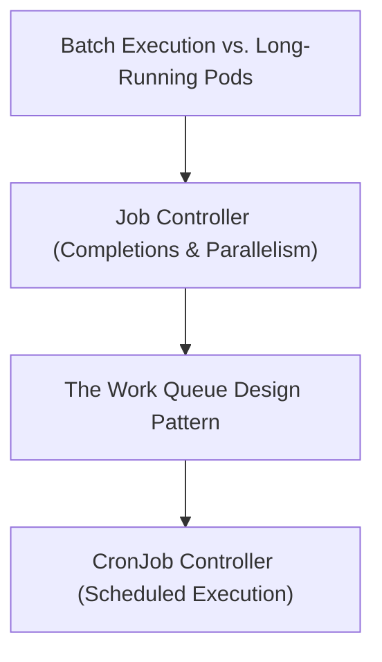

# Module 8-32: Jobs and CronJobs Scopes

This module covers Kubernetes Jobs and CronJobs, detailing batch execution, completions, parallelism, and the work queue pattern.

---

## 🗺️ Cognitive Map: How to Think About the Flow of Knowledge

To build a strong intuition for this domain, think of the topics as moving from foundational primitives to advanced implementations:



1. **Step 1: Workload Types (Section 1):** Comparing batch tasks with long-running services.
2. **Step 2: Job Configurations (Section 2):** Implementing completions, parallelism, and restart policies.
3. **Step 3: Work Queues (Section 3):** Designing queue-based processing systems.
4. **Step 4: Scheduling (Section 4):** Configuring CronJobs using schedule syntax.

By following this flow, you progress from **Batch Workloads → Job Parameters → Queue Processing → Scheduled Automation**.

---

## 1. Batch Workloads vs. Services

* **Services (Deployments):** Run continuously and are designed to stay online indefinitely.
* **Jobs:** Run to completion. The Job controller spins up one or more Pods, monitors them, and terminates them once the task is successfully completed.

---

## 2. Job Parameters

* `completions`: The number of times the task must complete successfully before the Job is marked complete.
* `parallelism`: The maximum number of Pods that can run concurrently.
* `backoffLimit`: The number of retries before marking the Job as failed.
* **Restart Policy:** Unlike Deployments, Pods managed by a Job must configure `restartPolicy: OnFailure` or `restartPolicy: Never`.

---

## 3. The Work Queue Pattern

Jobs are frequently used to process queues:
1. **Producer:** Publishes data to a message queue (such as RabbitMQ, Kafka, or AWS SQS).
2. **Consumer:** The Job controller spins up consumer Pods.
3. **Execution:** Each Pod pulls data from the queue, processes it, and terminates when the queue is empty. Pod coordination and queue-reading logic are handled by the application code.

---

## 4. CronJobs (Scheduled Execution)

A **CronJob** runs Jobs on a recurring schedule:
* **Schedule Syntax:** Configured using standard 5-field cron syntax (`minute hour day-of-month month day-of-week`).
```yaml
apiVersion: batch/v1
kind: CronJob
metadata:
  name: backup-cronjob
spec:
  schedule: "0 2 * * *"  # Runs every day at 2:00 AM
  jobTemplate:
    spec:
      template:
        spec:
          containers:
            - name: backup
              image: backup-tool
          restartPolicy: OnFailure
```
