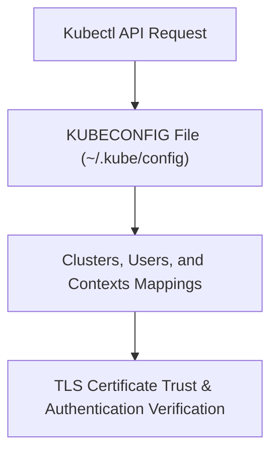

# Module 8-34: KUBECONFIG File Anatomy

This module covers the structure and configuration of the KUBECONFIG file used by `kubectl` to authenticate and route commands to Kubernetes clusters.

---

## 🗺️ Cognitive Map: How to Think About the Flow of Knowledge

To build a strong intuition for this domain, think of the topics as moving from foundational primitives to advanced implementations:



1. **Step 1: File Structure (Section 1):** Mapping out clusters, users, and contexts.
2. **Step 2: CLI Usage (Section 2):** Utilizing environment variables and flags to select configurations.
3. **Step 3: Cryptography (Section 3):** Understanding TLS verification and client certificate authority trust.

By following this flow, you progress from **File Parsing → CLI Selection → Cryptographic Validation**.

---

## 1. KUBECONFIG Components

A KUBECONFIG file (typically stored at `${HOME}/.kube/config`) organizes connection information using three collections:
* **Clusters:** Defines cluster API server endpoints and their associated Certificate Authority (CA) data:
  * `server`: The target API server URL.
  * `certificate-authority-data`: The base64-encoded CA certificate.
* **Users:** Stores the credentials used to authenticate against the clusters (e.g., client certificates, tokens, or cloud provider SSO details).
* **Contexts:** Binds a specific `user` to a specific `cluster` and default `namespace` (e.g., `context: user-admin + prod-cluster`).

---

## 2. Config Management & CLI Selection

* **Default Path:** `kubectl` searches for a config file at `${HOME}/.kube/config` unless overridden.
* **Environment Variable:** You can specify multiple configuration paths using the `KUBECONFIG` environment variable. `kubectl` merges these configurations at runtime.
* **Command Override:** You can target a specific config file directly using the `--kubeconfig` flag:
  ```bash
  kubectl --kubeconfig=/path/to/custom/config get pods
  ```
* **Context Switching:**
  ```bash
  # View configuration details
  kubectl config view

  # Switch context
  kubectl config use-context kind-kind
  ```

---

## 3. TLS Trust and Certificate Validation

* **TLS Handshake:** During the initial connection, the API server sends its certificate. `kubectl` uses the configured `certificate-authority` data to verify that the certificate was signed by a trusted authority.
* **Bypass Verification:** For test environments, you can disable TLS verification, though this exposes the connection to man-in-the-middle attacks:
  ```yaml
  insecure-skip-tls-verify: true
  ```
* **KinD Clusters:** KinD generates a KUBECONFIG file during cluster bootstrap using `kubeadm` commands executed inside control-plane containers, storing the TLS certs automatically.
