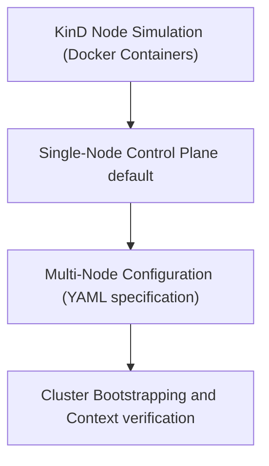

# Module 8-43: Kind Multi-Node Installation

This module covers the configuration, installation, and bootstrap operations for multi-node Kubernetes clusters running locally via KinD.

---

## 🗺️ Cognitive Map: How to Think About the Flow of Knowledge

To build a strong intuition for this domain, think of the topics as moving from foundational primitives to advanced implementations:



1. **Step 1: Architecture (Section 1):** Understanding Docker-in-Docker node emulation.
2. **Step 2: Single-Node defaults (Section 2):** Bootstrapping the default single-node cluster.
3. **Step 3: Multi-Node Configs (Section 3):** Specifying master and worker roles inside YAML manifests.

By following this flow, you progress from **Containerized Nodes → Single Node defaults → Multi-Node Configurations**.

---

## 1. KinD Node Emulation

* KinD (Kubernetes in Docker) deploys entire Kubernetes cluster nodes inside standalone Docker containers.
* **Node Capabilities:** Each container node runs its own instance of `systemd`, `kubelet`, `kube-proxy`, and the `containerd` container runtime. This allows developers to test complex scheduler rules, taints, and node affinities locally without virtual machines.

---

## 2. Default Single-Node Clusters

* **Bootstrap Command:**
  ```bash
  kind create cluster
  ```
* **Default Topology:** By default, KinD bootstraps a single-node cluster (`kind-control-plane`).
* **Merged Roles:** This single node runs both the Control Plane services (API server, etcd, scheduler) and executes application workloads, functioning as both the brain and execution node.

---

## 3. Bootstrapping Multi-Node Clusters

To test multi-node configurations, define the desired node topology inside a configuration YAML file:

### Cluster Configuration Manifest (`cluster-config.yaml`)
```yaml
kind: Cluster
apiVersion: kind.x-k8s.io/v1alpha4
nodes:
  - role: control-plane
  - role: worker
  - role: worker
```
Apply the configuration file during cluster bootstrap:
```bash
kind create cluster --config cluster-config.yaml
```
Verify that the nodes are running:
```bash
kubectl get nodes
```
