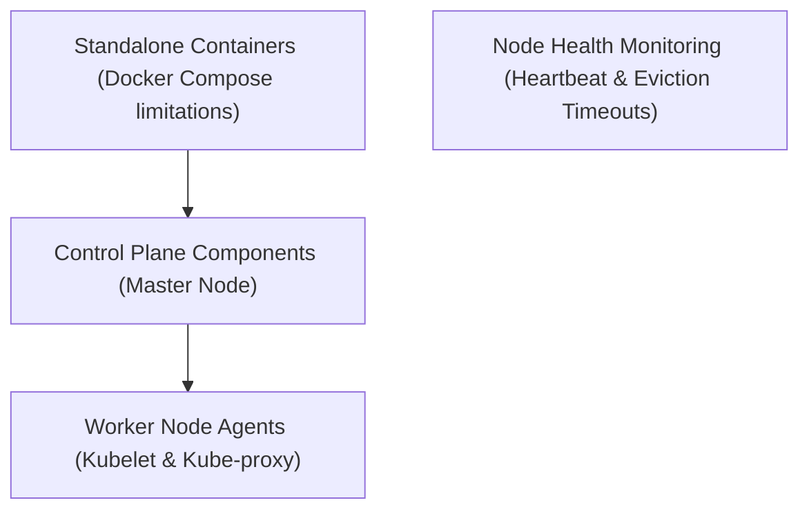

# Module 8-39: Kubernetes NTI Day 1 Lab

This module covers the core architectural components of a Kubernetes cluster, explaining the functions of the Control Plane and Worker nodes, and node failure detection windows.

---

## 🗺️ Cognitive Map: How to Think About the Flow of Knowledge

To build a strong intuition for this domain, think of the topics as moving from foundational primitives to advanced implementations:

1. **Step 1: Orchestration Needs (Section 1):** Identifying scaling limits of container groups.
2. **Step 2: Control Plane (Section 2):** Detailing the API server, etcd, scheduler, and controller manager.
3. **Step 3: Worker Nodes (Section 3):** Explaining host node execution agents.
4. **Step 4: Health Timeouts (Section 4):** Mapping heartbeat check timelines and node eviction windows.

By following this flow, you progress from **Orchestration Needs → Control Plane Coordination → Worker Node Execution → Node Failure Management**.

---

## 1. Container Management and Orchestration Need

* Standalone engines (like Docker Compose) can manage small container groups but struggle to scale beyond 50 containers. They lack native support for container-to-container network isolation, cross-host routing, and automated failover.
* Kubernetes provides a clustered runtime environment to automate the lifecycle of large-scale container deployments.

---

## 2. Control Plane (Master Node) Component Deep-Dive

The Control Plane manages the global state of the cluster:
* **API Server (`kube-apiserver`):** The REST gateway for the cluster. All components communicate via the API server; no external component can write directly to the database. It authenticates requests and validates schemas.
* **etcd Database:** A highly secure, low-latency, key-value datastore that stores the entire cluster configuration and metadata.
* **Scheduler (`kube-scheduler`):** Evaluates resource requirements (e.g., CPU, Memory requests) and assigns Pods to the most appropriate worker nodes based on its scheduling algorithm. By default, it targets a maximum allocation of 80% of node capacity.
* **Controller Manager (`kube-controller-manager`):** Runs controller loops (such as Node Controller, Job Controller) to regulate cluster state and reconcile differences between observed and desired configurations.

---

## 3. Worker Node Component Architecture

Worker nodes host the containerized workloads:
* **kubelet:** The node agent that communicates directly with the Control Plane API server. It receives Pod specs, instructs the container runtime engine to deploy containers, and monitors execution states.
* **kube-proxy:** Manages host network rules, distributing IP addresses and configuring packet routing to balance traffic across Pods. It decouples the network namespace from the container runtime to prevent routing conflicts.
* **Container Runtime Engine:** Pulls images, builds filesystems, and runs container processes (e.g., `containerd`).

---

## 4. Node Lifecycle Monitoring and Failure Detection

The Controller Manager monitors node health through a series of status checks:
1. **Heartbeat:** The `kubelet` sends a status update to the API server every **5 seconds**.
2. **Grace Period (40 seconds):** If the API server does not receive an update within **40 seconds**, the Controller Manager flags the node as unreachable.
3. **Unreachable Status:** The API server stops routing new requests to the node.
4. **Eviction Window (5 minutes):** If the node remains unreachable for **5 minutes**, the Controller Manager initiates Pod eviction, terminating the workloads and rescheduling them to healthy nodes.
* **Cloud Abstraction:** In managed cloud environments (such as AWS EKS), Control Plane host components are abstracted from users. Control Plane failures or VM maintenance are managed by the cloud provider.
