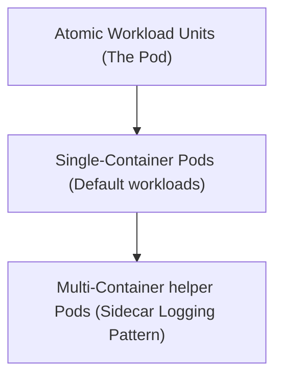

# Module 8-40: Kubernetes NTI Day 2 Lab

This module covers workload scheduling units, comparing single-container Pod configurations with multi-container helper (sidecar) patterns.

---

## 🗺️ Cognitive Map: How to Think About the Flow of Knowledge

To build a strong intuition for this domain, think of the topics as moving from foundational primitives to advanced implementations:

1. **Step 1: Workload Units (Section 1):** Defining Pod limits.
2. **Step 2: Helper Patterns (Section 2):** Implementing sidecars to aggregate application logs.

By following this flow, you progress from **Pod Concepts → Single Container → Sidecar Patterns**.

---

## 1. Workload Units

* In Kubernetes, the Pod is the smallest unit of deployment.
* By default, a Pod contains a single container running the main application process.

---

## 2. Multi-Container Helper Patterns (Sidecars)

In advanced configurations, a Pod can host multiple containers that work in tandem:
* **Sidecar Container:** A helper container that runs alongside the main application container to perform auxiliary tasks (e.g., a logging agent that reads the main container's stdout and streams it to a collector).
* **Lifecycle:** Both containers share the same network namespace and volume mounts, starting up and shutting down together.
