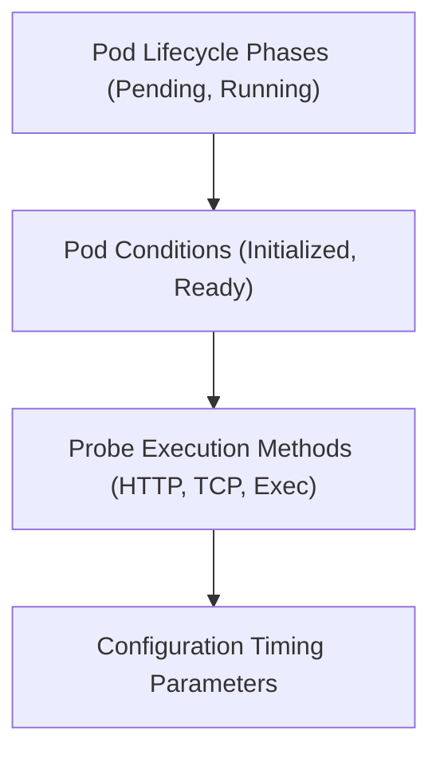

# Module 8-8: Probes Configurations Reference

This module covers the precise lifecycle states, conditions, and configuration parameters of Kubernetes health probes.

---

## 🗺️ Cognitive Map: How to Think About the Flow of Knowledge

To build a strong intuition for this domain, think of the topics as moving from foundational primitives to advanced implementations:

1. **Step 1: Lifecycle States (Section 1):** Mapping the operational phases and status conditions of a Pod.
2. **Step 2: Probe Types (Section 2):** Defining HTTP, TCP, and Exec probes.
3. **Step 3: Parameters (Section 3):** Standardizing the timing and threshold parameters of probes.

By following this flow, you progress from **Pod Status → Health Checking Strategies → Fine-Tuning Parameters**.

---

## 1. Pod Lifecycle and Conditions

### A. Pod Lifecycle Phases
1. **Pending:** The Pod is accepted by the cluster, but one or more containers are not yet running (e.g., downloading images or waiting for scheduling).
2. **Running:** The Pod has been bound to a node, and all containers have been created. At least one container is running, starting, or restarting.
3. **Succeeded:** All containers in the Pod have terminated successfully (exit code 0) and will not be restarted.
4. **Failed:** All containers in the Pod have terminated, and at least one container has terminated in failure (non-zero exit code).
5. **Unknown:** The state of the Pod cannot be obtained (typically due to communication issues between the control plane and the worker node's kubelet).

### B. Pod Conditions
* `PodScheduled`: The Pod has been successfully scheduled to a node.
* `Initialized`: All initialization containers have started and completed successfully.
* `ContainersReady`: All containers in the Pod are ready.
* `Ready`: The Pod is ready to serve requests and should be added to the load balancing pools of matching Services.

---

## 2. Probe Execution Methods

* **Exec:** Executes a command inside the container filesystem. An exit status of `0` is healthy; any non-zero exit status is unhealthy.
* **HTTP GET:** Sends an HTTP GET request to the container's IP address on a specified port and path.
* **TCP Socket:** Attempts to open a TCP connection to the container on a specified port. If the port is open, the check is successful.

---

## 3. Common Probe Configuration Parameters

To prevent premature restarts or network routing issues, tune the following settings:
* `initialDelaySeconds`: Number of seconds to wait after the container has started before activating the probe. Default is `0`.
* `periodSeconds`: How often (in seconds) to perform the probe. Default is `10`.
* `timeoutSeconds`: Number of seconds to wait for a probe response before marking it as failed. Default is `1`.
* `successThreshold`: Minimum consecutive successes needed to transition a probe from failed to successful. Default is `1`.
* `failureThreshold`: Number of consecutive failures needed to transition a probe from successful to failed. Default is `3`.

### Grace Period Operations
When a liveness probe fails and triggers a restart, the kubelet respects the `terminationGracePeriodSeconds` configuration. For readiness failures, the container continues running, but the `Ready` condition is updated to `false` and traffic routing is immediately paused.
