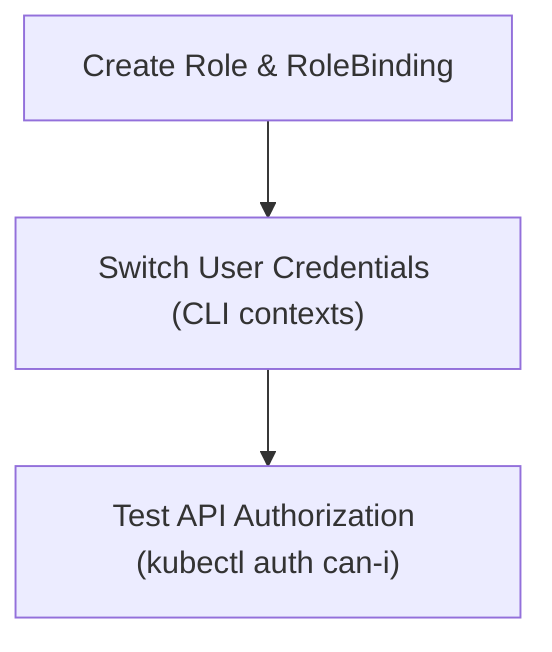

# Module 8-37: Roles & ClusterRoles Lab

This module covers the hands-on configuration of namespaced Roles and ClusterRoles, mapping users and testing access permissions.

---

## 🗺️ Cognitive Map: How to Think About the Flow of Knowledge

To build a strong intuition for this lab, follow the practical verification steps:



1. **Step 1: Manifest Definition (Section 1):** Deploying RBAC policies.
2. **Step 2: Authorization Testing (Section 2):** Validating user permissions.

---

## 1. Lab Setup and Manifests

In this lab, we configure user contexts to demonstrate how namespaced Roles restrict API actions. We create user accounts and bind them to specific namespaces using RoleBindings.

---

## 2. Interactive Lab Logs

* **Interactive Lab HTML Logs:** [rbac.html](rbac.html) (embed: `![[rbac.html]]`)
* **Verification Command:** To verify if a user has access to perform a specific action, run:
  ```bash
  kubectl auth can-i create pods --as=developer-user
  ```
