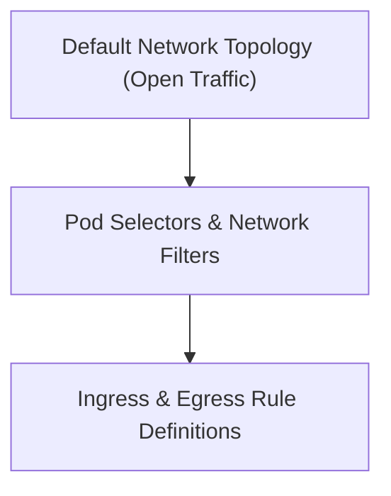

# Module 8-38: Security and NetworkPolicies

This module covers NetworkPolicies in Kubernetes, explaining how they define traffic isolation policies for Pods.

---

## 🗺️ Cognitive Map: How to Think About the Flow of Knowledge

To build a strong intuition for this domain, follow the security lifecycle:

1. **Step 1: Network Topology (Section 1):** Understanding default pod-to-pod communication paths.
2. **Step 2: Rule Mappings (Section 2):** Implementing ingress and egress traffic filtering rules.

By following this flow, you progress from **Flat Network Topologies → Granular Traffic Filters**.

---

## 1. Network Isolation and Traffic Flow

By default, Pod networking is flat; all Pods can communicate with all other Pods in the cluster without restrictions. To secure traffic and implement microsegmentation, configure **NetworkPolicies**:
* **Ingress:** Filters incoming traffic to Pods.
* **Egress:** Filters outgoing traffic from Pods.
* **Implementation:** NetworkPolicies require a compatible CNI network provider (e.g., Calico, Cilium) that enforces the policy rules.

---

## 2. Practical Reference

For detailed tutorials on configuring Kind-based NetworkPolicies, refer to the following guide:
* **Hands-on Guide:** [Secure Pod Traffic with K8s Network Policies](https://medium.com/@Vishwa22/secure-pod-traffic-with-k8s-network-policies-w-kind-hands-on-68845d94b017)
