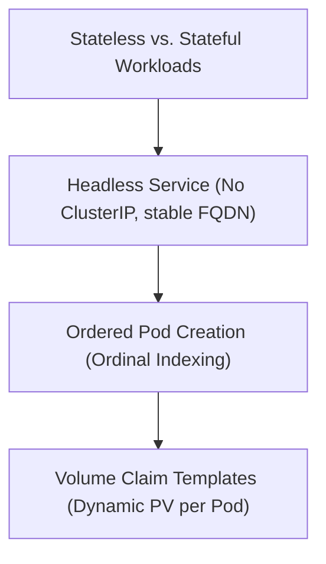

# Module 8-21: StatefulSets Configurations

This module covers StatefulSets, explaining how they differ from Deployments, and detailing ordered startup ordinals, headless services, and volume claim templates.

---

## 🗺️ Cognitive Map: How to Think About the Flow of Knowledge

To build a strong intuition for this domain, think of the topics as moving from foundational primitives to advanced implementations:

1. **Step 1: Workload Types (Section 1):** Comparing stateless (Deployments) and stateful (StatefulSets) application requirements.
2. **Step 2: Service Discovery (Section 2):** Configuring Headless Services to provide unique network identities.
3. **Step 3: Ordinality & Storage (Section 3 & 4):** Orchestrating startup sequences and binding unique persistent volumes dynamically.

By following this flow, you progress from **Workload Classification → Network Identity → Ordered Orchestration → Dedicated Storage**.

---

## 1. Stateless vs. Stateful Workloads

* **Stateless Workloads (Deployments):** Pods are identical and interchangeable. It does not matter which node a Pod runs on, and Pods do not maintain unique names or dedicated persistent storage.
* **Stateful Workloads (StatefulSets):** Designed for applications that require stable identities and persistent state (such as databases like MySQL, PostgreSQL, or message brokers like Kafka).

---

## 2. Headless Services and Network Identity

StatefulSets use a **Headless Service** to establish stable network identities for their Pods:
* **Definition:** A Service with `clusterIP: None`.
* **DNS Resolution:** Instead of returning a single ClusterIP, the Headless Service returns the IP addresses of all backing Pods. The client decides which Pod IP to communicate with.
* **Fully Qualified Domain Name (FQDN):** Each Pod in a StatefulSet receives a unique, predictable DNS name:
  `$(pod-name).$(service-name).$(namespace).svc.cluster.local`

---

## 3. Pod Ordinality and Startup Sequence

Pods in a StatefulSet are assigned a zero-indexed ordinal number (e.g., `web-0`, `web-1`, `web-2`).
* **Startup Sequence:** Pods are created sequentially, from lowest to highest ordinal. `web-1` will not start until `web-0` is fully `Running` and `Ready`.
* **Shutdown Sequence:** When scaling down or deleting, Pods are terminated in reverse order (highest to lowest ordinal).

---

## 4. Volume Claim Templates

To ensure each Pod maintains its own dedicated state, StatefulSets utilize a `volumeClaimTemplates` array:
* **Dynamic Binding:** Instead of sharing a single volume, the StatefulSet controller dynamically generates a unique `PersistentVolumeClaim` (PVC) for each Pod (e.g., `data-web-0`, `data-web-1`).
* **Persistence:** If `web-0` is deleted and rescheduled to another node, the controller binds it to its original PVC (`data-web-0`), preserving its database state.

### StatefulSet Storage Architecture
![[Pasted image 20250525095314.png]]
