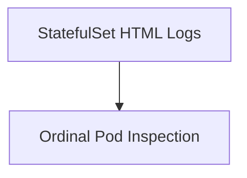

# Module 8-22: StatefulSets Lab Walkthrough

This module covers hands-on stateful workload deployment, ordinal scaling, and volume persistence testing.

---

## 🗺️ Cognitive Map: How to Think About the Flow of Knowledge

To build a strong intuition for this lab, follow the visual walkthrough and practical steps:

1. **Step 1: Lab Resources (Section 1):** Access the interactive logs and configurations for the StatefulSet lab.

---

## 1. Lab Resources

* **Interactive Lab HTML Logs:** [../Attachments/statefulset-lab.html](../Attachments/statefulset-lab.html) (embed: `![[../Attachments/statefulset-lab.html]]`)
