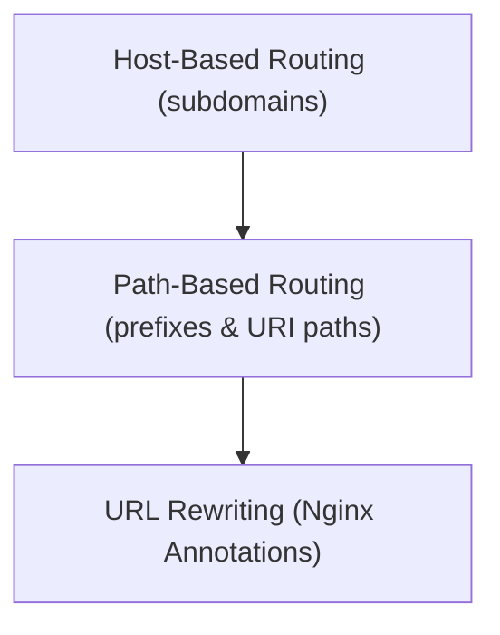

# Module 8-29: The Ingress Object Details

This module covers the configuration of Ingress routing rules, including host-based routing, path-based routing, and URL rewriting using annotations.

---

## 🗺️ Cognitive Map: How to Think About the Flow of Knowledge

To build a strong intuition for this domain, think of the topics as moving from foundational primitives to advanced implementations:



1. **Step 1: Host Routing (Section 1):** Routing traffic based on domain names.
2. **Step 2: Path Routing (Section 2):** Routing traffic based on URI paths.
3. **Step 3: Rewrites (Section 3):** Rewriting target paths using controller annotations.

By following this flow, you progress from **Domain Routing → URI Path Routing → Path Transformation**.

---

## 1. Host-Based Routing

Host-based routing directs traffic to different services based on the domain name in the HTTP host header:
```yaml
spec:
  rules:
    - host: app1.example.com
      http:
        paths:
          - path: /
            pathType: Prefix
            backend:
              service:
                name: app1-service
                port:
                  number: 80
    - host: app2.example.com
      http:
        paths:
          - path: /
            pathType: Prefix
            backend:
              service:
                name: app2-service
                port:
                  number: 80
```

---

## 2. Path-Based Routing

Path-based routing directs traffic to different services on the same host based on the request path:
* **Prefix Type:** Routes any path matching the specified prefix (e.g., `/api` matches `/api`, `/api/v1`, and `/api/v2`).
* **Exact Type:** Routes only exact path matches.
```yaml
spec:
  rules:
    - host: example.com
      http:
        paths:
          - path: /api
            pathType: Prefix
            backend:
              service:
                name: api-service
                port:
                  number: 80
```

---

## 3. Ingress Annotations and URL Rewrites

* **Rewrites:** Frequently, the backend application expects requests at the root path (`/`), but the Ingress routes them via a sub-path (like `/app`).
* **The Solution:** Use Ingress annotations to instruct the reverse proxy to rewrite the request path before forwarding it to the backend.
* **Nginx Controller Example:**
  ```yaml
  metadata:
    name: rewrite-ingress
    annotations:
      nginx.ingress.kubernetes.io/rewrite-target: /$2
  spec:
    rules:
      - host: example.com
        http:
          paths:
            - path: /app(/|$)(.*)
              pathType: Prefix
              backend:
                service:
                  name: app-service
                  port:
                    number: 80
  ```
