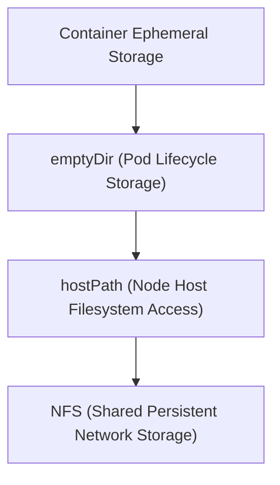

# Module 8-20: Volumes and Storage Mounts

This module covers the Kubernetes volume abstraction layer, explaining container storage lifecycles, and comparing emptyDir, hostPath, and NFS volumes.

---

## 🗺️ Cognitive Map: How to Think About the Flow of Knowledge

To build a strong intuition for this domain, think of the topics as moving from foundational primitives to advanced implementations:



1. **Step 1: Ephemeral Storage (Section 1):** Understanding container filesystem limitations.
2. **Step 2: emptyDir Volumes (Section 2):** Implementing Pod-level storage for scratch space and caches.
3. **Step 3: Host & Network Storage (Section 3):** Comparing hostPath node access with network-attached persistent storage (NFS).

By following this flow, you progress from **Ephemeral Containers → Pod-Level Storage → Network Persistent Storage**.

---

## 1. Container Storage Ephemerality

* Containers have an ephemeral storage layer. If a container crashes and restarts, any files written to its filesystem are lost.
* To persist files across container restarts or share data between containers in the same Pod, you must configure a **Volume**.

---

## 2. Pod-Level Storage (`emptyDir`)

An `emptyDir` volume is created when a Pod is assigned to a node, and exists as long as that Pod runs on that node.
* **Lifecycle:** The volume's contents are permanently deleted when the Pod is deleted or evicted. However, the data persists across container crashes and restarts.
* **Shared Storage:** Multiple containers in the same Pod can mount the same `emptyDir` volume to share files.
* **Common Use Cases:**
  * **Caching:** Storing cache databases to reduce external database queries.
  * **Process Checkpoints:** Saving checkpoints for long-running processes so they can resume from where they stopped if a container restarts.
  * **Scratch Space:** Providing temporary sorting or merging filesystems.

---

## 3. Node and Network Storage Types

### A. Host Storage (`hostPath`)
Mounts a file or directory from the host node's filesystem directly into the container.
* **Use Case:** Primarily for system-level utilities or DaemonSets that need to interact with the host node (e.g., mounting `/var/log` to collect system logs).
* **Limitation:** If a Pod is rescheduled to another node, it will access a completely different host path, losing access to the previous node's files.

### B. Network File System (`nfs`)
Mounts an external NFS export into the Pod over the network.
* **Persistence:** Because the storage is decoupled from the cluster nodes, data is persistent even if Pods are rescheduled to other nodes.
* **Shared Write:** Multiple Pods running on different nodes can read from and write to the same NFS volume simultaneously.
* **Example Config:**
  ```yaml
  volumes:
    - name: nfs-storage
      nfs:
        server: 192.168.1.8
        path: /mnt/shared
  ```
