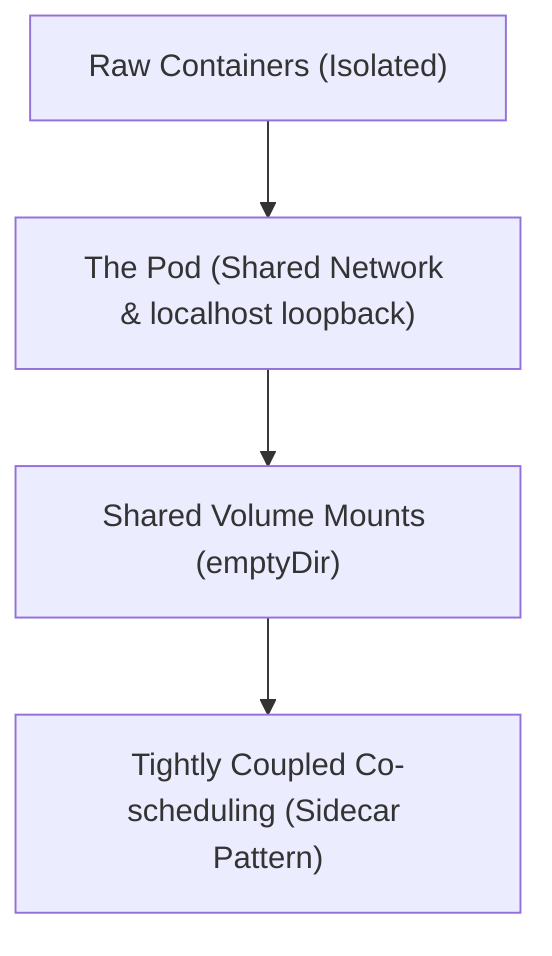

# Module 8-2: Why Kubernetes uses Pods

This module covers the core design principles of the Kubernetes Pod, explaining why Kubernetes deploys pods rather than raw containers, and how containers share networks and storage.

---

## 🗺️ Cognitive Map: How to Think About the Flow of Knowledge

To build a strong intuition for this domain, think of the topics as moving from foundational primitives to advanced implementations:

1. **Step 1: The Atomic Unit (Section 1):** Understanding the Pod as the smallest deployable unit in Kubernetes.
2. **Step 2: Shared Network & Loopback (Section 2):** Explaining how containers inside a Pod share the network namespace and port space.
3. **Step 3: Storage & Sidecar Design (Section 3):** Detailing how containers share volumes and support each other through patterns like sidecars.

By following this flow, you progress from **Isolated Containers → Shared Network & Namespaces → Tightly Coupled Architectures**.

---

## 1. The Pod as the Atomic Unit

In Kubernetes, a Pod is the smallest deployable unit that developers configure and manage.
* Instead of deploying raw containers directly (as in Docker Compose), Kubernetes groups one or more containers into a single Pod.
* Containers inside a Pod are co-scheduled, meaning they start up and scale down together, acting as a single unified management unit.

---

## 2. Shared Network Namespace

All containers within a single Pod share the same network namespace and IP address.
* **Localhost Loopback:** Containers can communicate with one another directly via `localhost` (e.g., Container A on `localhost:80` and Container B on `localhost:8080`). They function similarly to processes running on the same host machine.
* **Port Conflicts:** Because they share the network namespace, two containers within the same Pod cannot bind to the same port.
* **Latency Reduction:** Co-locating tightly coupled containers inside a single Pod eliminates the network latency and routing overhead that occurs when containers communicate across different host nodes.

---

## 3. Shared Storage and Pod Patterns

Although containers within a Pod have isolated filesystems by default, they can share storage using volumes:
* **Shared Volumes (`emptyDir`):** An `emptyDir` volume is created at the Pod level and exists as long as the Pod runs. Multiple containers in the Pod can mount this volume to read and write files to the same shared space.
* **Tightly Coupled Sidecar Pattern:** This is useful for auxiliary tasks such as log shipping or proxying. For example, an Nginx main container serves web traffic while a sidecar container consumes Nginx access logs and streams them to a centralized logging engine. Both containers must run together on the same node to function.
