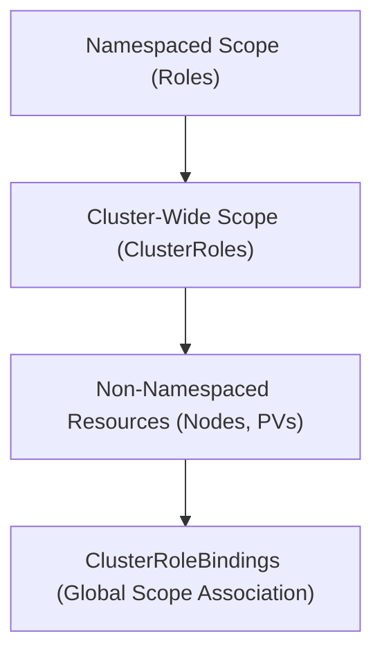

# Module 8-36: RBAC: Cluster Roles

This module covers ClusterRoles and ClusterRoleBindings, explaining how they manage permissions for cluster-wide and non-namespaced resources.

---

## 🗺️ Cognitive Map: How to Think About the Flow of Knowledge

To build a strong intuition for this domain, think of the topics as moving from foundational primitives to advanced implementations:



1. **Step 1: Scope Differences (Section 1):** Comparing namespaced Roles with cluster-wide ClusterRoles.
2. **Step 2: Resources (Section 2):** Defining access rules for non-namespaced cluster components.
3. **Step 3: Bindings (Section 3):** Attaching ClusterRoles to subjects using ClusterRoleBindings.

By following this flow, you progress from **Namespaced Isolation → Cluster-Wide Permissions → Non-Namespaced Routing**.

---

## 1. Namespaced Roles vs. Cluster-Scoped Roles

* **Role:** Limited to resources inside a single namespace.
* **ClusterRole:** Applies cluster-wide. It is used to:
  * Manage namespaced resources across all namespaces in the cluster.
  * Manage non-namespaced resources.
  * Define access to administrative URL paths (e.g., `/healthz`).

---

## 2. ClusterRole Mechanics and Non-Namespaced Resources

Some Kubernetes resources do not belong to any namespace (e.g., Nodes, PersistentVolumes, Namespaces).
* **Role Incompatibility:** You cannot use a namespaced `Role` to authorize access to Nodes or PersistentVolumes.
* **ClusterRole Solution:** A `ClusterRole` must be defined to authorize access to these resources.
```yaml
apiVersion: rbac.authorization.k8s.io/v1
kind: ClusterRole
metadata:
  name: node-reader
rules:
  - apiGroups: [""]
    resources: ["nodes"]
    verbs: ["get", "list", "watch"]
```

---

## 3. ClusterRoleBindings

* A **ClusterRoleBinding** binds a ClusterRole to subjects cluster-wide.
* If you bind a ClusterRole using a namespaced `RoleBinding`, the permissions defined in the ClusterRole are restricted to the namespace of the RoleBinding.
* If you bind it using a `ClusterRoleBinding`, the permissions apply globally across all namespaces in the cluster.
