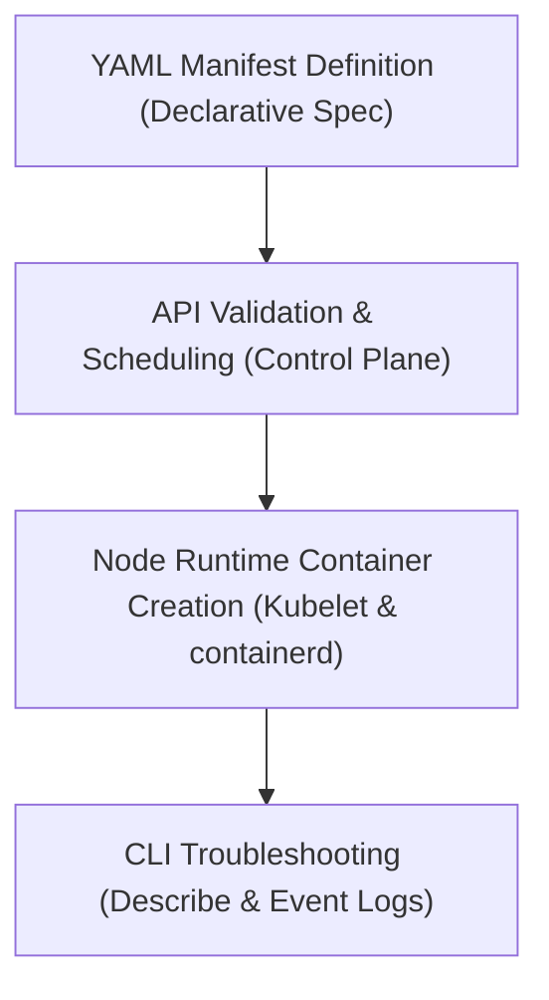

# Module 8-4: Creating Pods Configuration

This module covers the differences between imperative and declarative pod creation, the backend scheduling lifecycle, and basic pod troubleshooting techniques.

---

## 🗺️ Cognitive Map: How to Think About the Flow of Knowledge

To build a strong intuition for this domain, think of the topics as moving from foundational primitives to advanced implementations:



1. **Step 1: Creation Approaches (Section 1):** Comparing imperative commands with declarative YAML manifests.
2. **Step 2: Scheduling & Execution (Section 2):** Detailing how a pod request moves from the API server to scheduling and container runtime execution.
3. **Step 3: Troubleshooting Unscheduled Pods (Section 3):** Understanding the causes of the "Pending" state.
4. **Step 4: Diagnostics (Section 4):** Using kubectl commands to extract pod diagnostics and inspect cluster event logs.

By following this flow, you progress from **Spec Definition → Scheduling Engine → Runtime Execution → Debugging CLI**.

---

## 1. Imperative vs. Declarative Approaches

* **Imperative Approach:** Creating a Pod directly via CLI commands. This is useful for quick testing:
  ```bash
  kubectl run web --image=nginx
  ```
* **Declarative Approach:** Defining the desired state inside a YAML configuration manifest and letting Kubernetes reconcile the actual state:
  ```bash
  kubectl apply -f pod.yml
  ```

### Pod Manifest Example (`pod.yml`)
```yaml
apiVersion: v1
kind: Pod
metadata:
  name: web
spec:
  containers:
    - name: web
      image: nginx
      ports:
        - containerPort: 80
          name: http
          protocol: TCP
```

---

## 2. Pod Lifecycle and Creation Flow

When a user executes `kubectl apply -f pod.yml`, the following operations occur:
1. **API Validation:** `kubectl` serializes the manifest and sends it via HTTP to the `kube-apiserver`, which validates the schema.
2. **Scheduling:** The `kube-scheduler` detects the new unscheduled Pod, identifies the most suitable worker node based on resource availability, and binds the Pod to that node.
3. **Execution:** The `kubelet` on the selected worker node is notified of the binding and instructs the local container runtime (e.g., `containerd`, `podman`) to pull the image and run the container.

---

## 3. Troubleshooting Pending Pods

If the scheduler fails to assign a Pod to a node, the Pod remains in a **Pending** status. Common causes include:
* **Resource Exhaustion:** No node has enough unallocated CPU or Memory to satisfy the Pod's resource requests.
* **Taints and Tolerations:** The nodes are tainted, and the Pod spec lacks the corresponding tolerations.
* **Node Selectors & Affinity:** The Pod spec specifies node affinity rules or selectors that do not match any available nodes.

---

## 4. Troubleshooting and Diagnostic Commands

Use the following commands to diagnose issues with your Pods:
```bash
# View detailed information about the pods, including IP addresses and host nodes
kubectl get pods -o wide

# Describe pod configuration and show the event log (crucial for scheduling errors)
kubectl describe pods web

# Delete the pod
kubectl delete pods web
```
