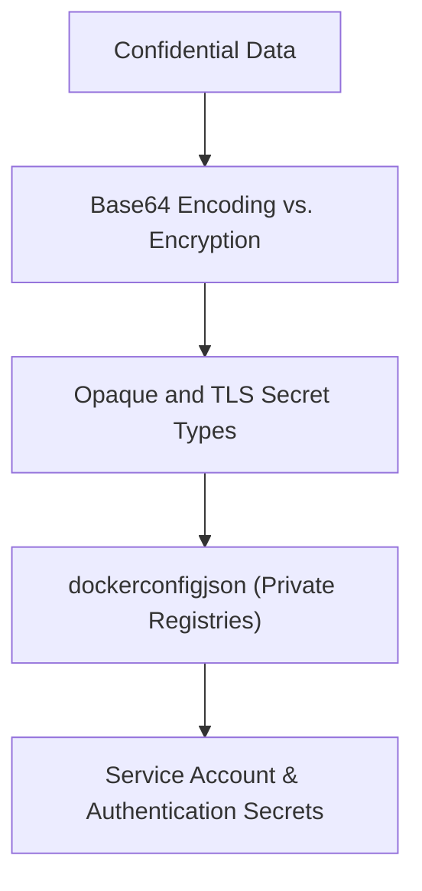

# Module 8-15: Introduction to Secrets

This module covers the security model of Kubernetes Secrets, detailing the different secret types, base64 encoding mechanics, and namespace access controls.

---

## 🗺️ Cognitive Map: How to Think About the Flow of Knowledge

To build a strong intuition for this domain, think of the topics as moving from foundational primitives to advanced implementations:



1. **Step 1: Base64 Encoding (Section 1):** Understanding that Kubernetes Secrets are encoded, not encrypted by default.
2. **Step 2: Core Secret Types (Section 2):** Implementing Opaque, TLS, and private registry secrets.
3. **Step 3: Auth Secrets (Section 3):** Explaining Service Accounts, Basic Auth, and SSH Authentication secrets.

By following this flow, you progress from **Data Encoding → Types Configuration → Cluster Access Management**.

---

## 1. Security Model of Kubernetes Secrets

* **Base64 Encoding:** By default, Kubernetes Secrets are stored in `etcd` as plain base64-encoded strings. Base64 is not encryption; it is easily decoded.
* **Access Control (RBAC):** To secure secrets, access must be restricted using namespaces and Role-Based Access Control (RBAC). Only authorized users and service accounts should have permission to read secrets within a namespace.
* **Decryption at Runtime:** External encryption-at-rest tools (such as HashiCorp Vault or AWS KMS) encrypt secrets before they reach the cluster, but Kubernetes decrypts them at the API layer so container processes can consume them in plain text.
* **Environment Verification:** Inside a container, environment variables sourced from secrets are exposed in plain text to allow the application process to consume them:
  ```bash
  kubectl exec -it <pod-name> -- env
  ```

---

## 2. Core Secret Types

### A. Opaque Secrets (`Opaque`)
The default type for general-purpose configuration secrets (such as databases or API keys).
* **Usage:** Keys and values are arbitrary strings.

### B. TLS Secrets (`kubernetes.io/tls`)
Designed specifically for storing TLS certificates and private keys:
* **Required Keys:** Must contain `tls.crt` and `tls.key`. Applications (such as Ingress Controllers) rely on these exact keys to load certificates.

### C. Docker Registry Secrets (`kubernetes.io/dockerconfigjson`)
Stores credentials for pulling images from private container registries.
* **Usage:** Configured inside the Pod spec using `imagePullSecrets`.
* **Imperative Creation Command:**
  ```bash
  kubectl create secret docker-registry my-registry-secret \
    --docker-server=<registry-server> \
    --docker-username=<username> \
    --docker-password=<password> \
    --docker-email=<email>
  ```

---

## 3. API and Authentication Secrets

### A. Service Account Secrets (`kubernetes.io/service-account-token`)
Used by Pods to authenticate requests to the Kubernetes API server.
* **Mechanics:** The API server generates the token secret automatically when a ServiceAccount is created, and mounts it into the Pod at `/var/run/secrets/kubernetes.io/serviceaccount`.
* *Note:* While authentication is handled automatically, authorization (what the Pod is allowed to do) must be configured using RBAC Roles and RoleBindings.

### B. Basic Authentication Secrets (`kubernetes.io/basic-auth`)
Designed for basic HTTP authentication, requiring two keys:
* `username`
* `password`

### C. SSH Authentication Secrets (`kubernetes.io/ssh-auth`)
Used for SSH key credential authentication.
* **Implementation:** The private key is mounted into the container as a read-only volume to prevent modifications.
