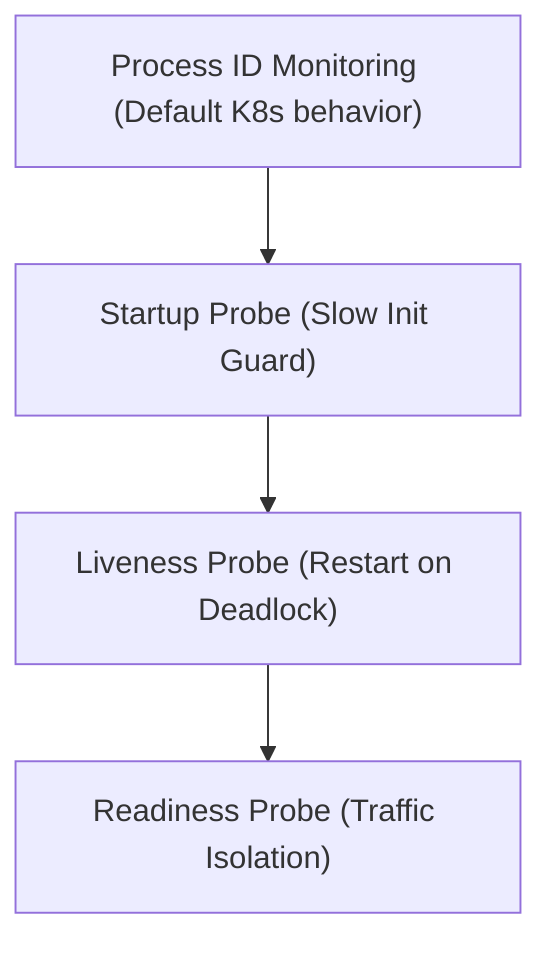

# Module 8-7: Liveness, Readiness & Startup Probes

This module covers the core self-healing and traffic-routing mechanics in Kubernetes: Liveness, Readiness, and Startup probes, along with their configuration templates and actions.

---

## 🗺️ Cognitive Map: How to Think About the Flow of Knowledge

To build a strong intuition for this domain, think of the topics as moving from foundational primitives to advanced implementations:



1. **Step 1: Process Checks (Section 1):** Understanding why basic process monitoring is insufficient for deep application health checks.
2. **Step 2: Startup Probes (Section 2):** Protecting slow-starting applications during initialization.
3. **Step 3: Liveness Probes (Section 3):** Automatically restarting stalled or deadlocked containers.
4. **Step 4: Readiness Probes (Section 4):** Controlling traffic routing to guarantee only ready containers receive requests.

By following this flow, you progress from **Process State → Startup Verification → Crash Mitigation → Traffic Isolation**.

---

## 1. Process Monitoring vs. Deep Health Checks

* By default, the `kubelet` only monitors if the main process ID (PID) inside a container is active.
* If an application deadlocks or fails internally but the process continues running, Kubernetes will observe the container as healthy. However, users will experience service failures.
* **Probes** provide active health checking (HTTP, TCP, or Exec commands) to ensure the application is functioning correctly.

---

## 2. Startup Probes

* **Action:** Disables liveness and readiness probes until the startup probe succeeds. If it fails, the container is restarted.
* **Use Case:** Designed for slow-starting applications. It gives them a generous initialization window without risking premature liveness restarts.
* **Example Config:**
  ```yaml
  ports:
    - name: liveness-port
      containerPort: 8080
  livenessProbe:
    httpGet:
      path: /healthz
      port: liveness-port
    failureThreshold: 1
    periodSeconds: 10
  startupProbe:
    httpGet:
      path: /healthz
      port: liveness-port
    failureThreshold: 30
    periodSeconds: 10
  ```
  In this configuration, the application has 300 seconds (30 * 10s) to complete its startup. Once it succeeds, the liveness probe takes over.

---

## 3. Liveness Probes

* **Action:** Restarts the container.
* **Lifecycle:** Runs periodically throughout the container's lifecycle.
* **Use Case:** Detects internal deadlocks or memory locks where the process runs but cannot recover.
* **HTTP GET Probe Example:**
  ```yaml
  livenessProbe:
    httpGet:
      path: /healthy
      port: 8080
    initialDelaySeconds: 5
    timeoutSeconds: 1
    periodSeconds: 10
    failureThreshold: 3
    successThreshold: 1
  ```
  * **HTTP Responses:** Status codes between `200` and `399` indicate success. Codes `400` or higher indicate failure.

---

## 4. Readiness Probes

* **Action:** Removes the Pod's IP from the Service load balancer pool.
* **Lifecycle:** Runs periodically throughout the container's lifecycle.
* **Use Case:** Detects when an application is temporarily unable to serve traffic (e.g., loading large datasets, warming caches, or waiting for database connections).
* **YAML Example:**
  ```yaml
  readinessProbe:
    httpGet:
      path: /healthz
      port: 80
    initialDelaySeconds: 5
    periodSeconds: 10
  ```
* **Readiness Failure Recovery:** Unlike liveness probes, readiness failures do not cause container restarts. When the readiness check succeeds again, the container is added back to the traffic routing pool.
