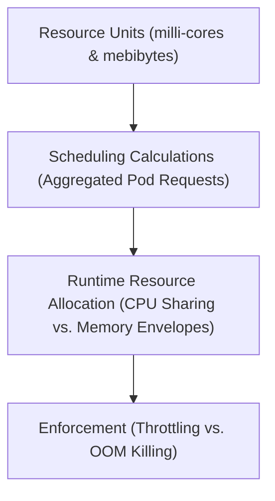

# Module 8-9: Pods Requests and Limits Math

This module covers the core mechanics of resource scheduling and isolation in Kubernetes, including CPU and Memory units, scheduling calculations, and resource enforcement.

---

## 🗺️ Cognitive Map: How to Think About the Flow of Knowledge

To build a strong intuition for this domain, think of the topics as moving from foundational primitives to advanced implementations:

1. **Step 1: Resource Units (Section 1):** Defining how CPU and Memory are measured in manifests.
2. **Step 2: Pod-Level Scheduling (Section 2):** Calculating the total resource request of a Pod for scheduling decisions.
3. **Step 3: Resource Enforcement (Section 3):** Distinguishing how CPU over-allocation (throttling) and Memory over-allocation (OOM kills) are managed by the kernel.

By following this flow, you progress from **Resource Units → Scheduling Calculations → Runtime Enforcement**.

---

## 1. Resource Units

* **CPU Units:** Measured in cores. Fractional values are specified in millicores (denoted with `m`).
  * `1000m` is equivalent to 1 CPU core.
  * `500m` is equivalent to 0.5 CPU cores.
  * `1m` is the minimum allowable CPU increment.
* **Memory Units:** Measured in bytes. It is best practice to use binary prefixes (power-of-2: `Ki`, `Mi`, `Gi`) rather than decimal prefixes (power-of-10: `K`, `M`, `G`) because OS memory calculations are binary-based.
  * `128Mi` (Mebibytes) = $128 \times 1024 \times 1024$ bytes.
  * `128M` (Megabytes) = $128 \times 1000 \times 1000$ bytes.

---

## 2. Pod-Level Scheduling Calculations

The scheduler treats a Pod as a single resource reservation unit.
* **Calculation:** The scheduler sums the resource requests of all containers inside the Pod.
  * Container A request: `100m` CPU, `200Mi` Memory.
  * Container B request: `100m` CPU, `200Mi` Memory.
  * **Total Pod Request:** `200m` CPU, `400Mi` Memory.
* **Placement:** The scheduler will only place the Pod on a node that has at least `200m` CPU and `400Mi` Memory of unallocated capacity. If no such node exists, the Pod remains in a `Pending` state.

---

## 3. Runtime Resource Enforcement

Kubernetes enforces resource usage differently for CPU and Memory:

### A. CPU (Compressible Resource)
* If a Pod exceeds its CPU request but remains below its CPU limit, the kernel will allow the Pod to use idle CPU cycles.
* If multiple Pods surge and compete for CPU, the kernel allocates CPU shares proportionally based on their configured requests.
* If a Pod exceeds its CPU **limit**, the kernel throttles the container's CPU shares, reducing performance without killing the process.

### B. Memory (Non-Compressible Resource)
* If a Pod attempts to allocate more memory than its configured request, the host kernel allows it as long as there is free physical memory on the host.
* If the host experiences memory pressure, the kernel selectively terminates processes using the **Out of Memory (OOM) Killer**. The kernel assigns OOM scores based on the Pod's Quality of Service (QoS) tier (derived from requests and limits).
* If a container attempts to allocate memory beyond its configured **limit**, the kernel immediately terminates it with an `OOMKilled` (Exit Code 137) error. The container is then restarted according to the Pod's restart policy.
