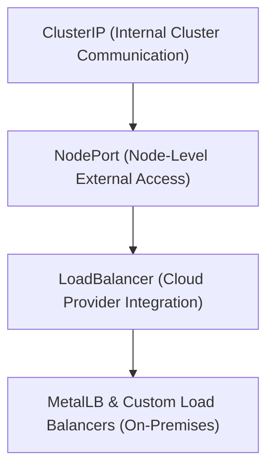

# Module 8-24: Service Types Comparison

This module covers the different Service types in Kubernetes, comparing ClusterIP, NodePort, and LoadBalancer services, and discussing external configurations like MetalLB.

---

## 🗺️ Cognitive Map: How to Think About the Flow of Knowledge

To build a strong intuition for this domain, think of the topics as moving from foundational primitives to advanced implementations:

1. **Step 1: ClusterIP (Section 1):** Restricting communication to internal cluster networks.
2. **Step 2: NodePort (Section 2):** Opening ports on worker nodes to allow external ingress.
3. **Step 3: LoadBalancer (Section 3):** Provisioning cloud provider load balancers to establish a single external entry point.
4. **Step 4: On-Premises (Section 4):** Running load balancers on physical networks using MetalLB.

By following this flow, you progress from **Internal Only → Node Exposure → Cloud Gateway → Physical Network Routing**.

---

## 1. ClusterIP (Default)

* **Behavior:** Exposes the Service on an internal cluster-only IP.
* **Access:** backends can only be accessed by other Pods running within the same cluster. External clients cannot communicate with a ClusterIP service directly.

---

## 2. NodePort

* **Behavior:** Exposes the Service externally by binding a static port to every worker node's IP address.
* **Port Range:** Allocates a port from the default range of `30000` to `32767`.
* **Access:** External clients can connect to the Service by querying any node's IP address on the allocated `nodePort` (e.g., `http://<node-ip>:<node-port>`).
* **Routing:** `kube-proxy` routes the traffic from the node's port to one of the backing Pods, even if the Pod is running on a different node.
* **Limitation:** If a specific node goes offline, clients using that node's IP will experience failures.

---

## 3. LoadBalancer

* **Behavior:** Integrates with cloud providers (such as AWS, Azure, GCP) to automatically provision an external load balancer.
* **Access:** The cloud provider generates a public IP or DNS name. Traffic entering this load balancer is automatically routed to the cluster's NodePorts and then distributed to the backing Pods.
* **Cost Efficiency:** Cloud load balancers incur hosting costs. To save costs, organizations typically deploy a single external load balancer pointing to an Ingress Controller rather than provisioning a separate LoadBalancer service for every internal microservice.

---

## 4. MetalLB and Custom Load Balancers

For on-premises or bare-metal clusters that lack cloud provider integrations, you can deploy **MetalLB**:
* **Layer 2 Mode:** Allocates virtual IP addresses to Services from a configured IP pool. One node acts as the traffic leader, answering ARP requests for the virtual IP.
* **BGP Mode (Layer 3):** Peer nodes establish BGP sessions with network routers, advertising routing paths to the Service's virtual IP addresses.
* **Manual Setup:** Alternatively, you can configure physical hardware load balancers (such as F5 BIG-IP) or software proxies (such as Nginx) by manually registering the cluster node IPs and NodePort values as backends.
