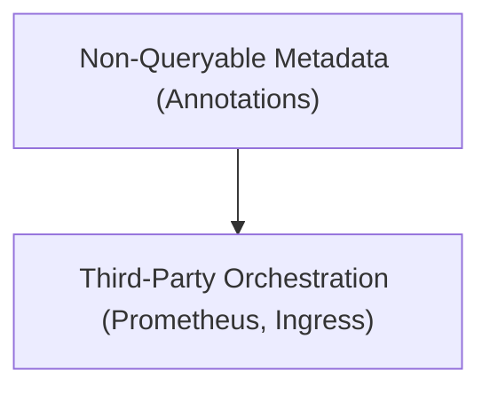

# Module 8-6: Using Annotations Metadata

This module covers the purpose of Annotations, how they differ from Labels, and how tools use annotations to configure cluster services.

---

## 🗺️ Cognitive Map: How to Think About the Flow of Knowledge

To build a strong intuition for this domain, think of the topics as moving from foundational primitives to advanced implementations:



1. **Step 1: Purpose (Section 1):** Distinguishing annotations from queryable labels.
2. **Step 2: Practice (Section 2):** Applying annotations for third-party tools (like Prometheus metric scraping).

By following this flow, you progress from **Metadata Storage → Component Integration**.

---

## 1. Annotations vs. Labels

* **Annotations** are key-value metadata fields attached to Kubernetes resources.
* **Key Difference from Labels:** Annotations cannot be used to select or filter objects. They are not indexed by the API server.
* **Usage:** Annotations are designed to store unstructured metadata or configuration parameters used by external tools, clients, and library orchestrators (e.g., build IDs, git commits, or ingress rewrite rules).
* **Anti-Pattern:** Do not use annotations as a general-purpose database for your application. The API server stores this data in etcd; high-write metadata should be kept in a dedicated external datastore like Redis.

---

## 2. Practical Annotations Use Case

Annotations are frequently used to instruct tools like Prometheus how to scrape application metrics from a Pod:
```yaml
metadata:
  name: my-app
  annotations:
    prometheus.io/scrape: "true"
    prometheus.io/port: "8080"
    prometheus.io/path: "/metrics"
```
In this scenario, Prometheus queries the API server for Pod annotations, discovers these keys, and dynamically adds the Pod to its metric collection targets.
