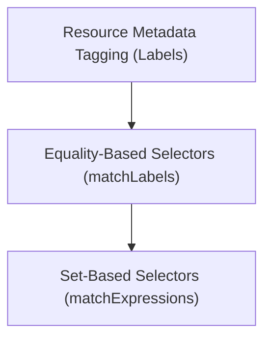

# Module 8-5: Using Labels and Selectors

This module covers the core concepts of using Labels to tag, organize, and query Kubernetes resources, and Selectors to define relationships between controllers and pods.

---

## 🗺️ Cognitive Map: How to Think About the Flow of Knowledge

To build a strong intuition for this domain, think of the topics as moving from foundational primitives to advanced implementations:



1. **Step 1: Labels (Section 1):** Tagging resources with key-value metadata.
2. **Step 2: Selection Logic (Section 2):** Filtering and connecting resources using equality and set-based selection patterns.

By following this flow, you progress from **Tagging Metadata → Querying & Filtering**.

---

## 1. Labels and Metadata Tagging

* **Labels** are key-value pairs attached to Kubernetes objects (such as Pods).
* Unlike names, labels do not provide uniqueness. Instead, they are used to group, filter, and organize resources (e.g., tagging resources with `env: dev`, `tier: frontend`, or `app: api`).
* Many controllers (like ReplicaSets and Services) use labels to identify and manage the collection of Pods they should act upon.

---

## 2. Filtering Resources Using Selectors

Selectors filter resources based on their labels. There are two types of selectors:

### A. Equality-Based Selectors
Select resources based on exact key-value matches (using `matchLabels` in manifests):
```yaml
selector:
  matchLabels:
    app: myapp
    env: production
```
In this configuration, Kubernetes applies an **AND** logic operation: a Pod must carry both labels to be selected.

### B. Set-Based Selectors
Select resources based on set operations (using `matchExpressions` in manifests):
```yaml
selector:
  matchExpressions:
    - {key: app, operator: In, values: [myapp, api]}
    - {key: env, operator: NotIn, values: [development]}
```
Supported operators in matchExpressions include:
* `In`: The label key must match one of the specified values.
* `NotIn`: The label key must not match any of the specified values.
* `Exists`: The label key must be present on the object (the value is ignored).
* `DoesNotExist`: The label key must not be present on the object.
