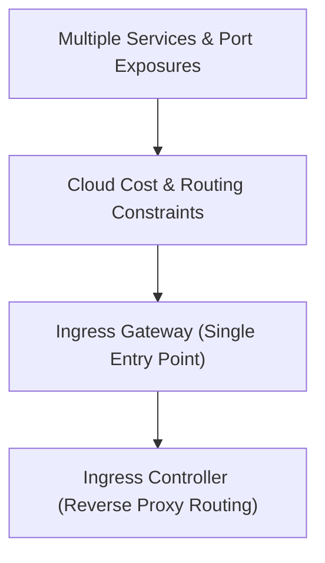

# Module 8-28: What is an Ingress Object

This module covers Ingress resources, explaining how an Ingress Controller acts as a single gateway to route external HTTP/HTTPS traffic to multiple internal ClusterIP services.

---

## 🗺️ Cognitive Map: How to Think About the Flow of Knowledge

To build a strong intuition for this domain, think of the topics as moving from foundational primitives to advanced implementations:

1. **Step 1: Cost Constraints (Section 1):** Identifying the resource and cost limitations of NodePort and LoadBalancer services.
2. **Step 2: Ingress Abstraction (Section 2):** Using Ingress to centralize traffic management.
3. **Step 3: Controllers (Section 3):** Understanding how Ingress Controllers (such as Nginx) process ingress routing rules.

By following this flow, you progress from **Service Exposure Limitations → Centralized Gateways → Reverse Proxy Routing**.

---

## 1. Limitations of Service Exposure

* In microservice architectures, exposing every service using a NodePort or LoadBalancer is inefficient.
* **NodePort Drawbacks:** Requires managing custom port numbers (30000-32767) for each service and exposes node IPs directly to users.
* **LoadBalancer Drawbacks:** Allocating a dedicated LoadBalancer service for each application on cloud platforms is expensive.

---

## 2. Ingress as a Unified Gateway

* **Ingress** is an API object that manages external access to services, typically handling HTTP and HTTPS traffic.
* **Centralized Entry Point:** It consolidates routing rules into a single resource, routing traffic to different internal ClusterIP services based on host headers or URI paths.

---

## 3. Ingress Controller Architecture

* **The Controller:** The Ingress resource is only a metadata definition. To execute routing rules, an **Ingress Controller** must be deployed in the cluster.
* **Mechanics:** The Ingress Controller runs as a reverse proxy (e.g., Nginx, HAProxy, Envoy). It monitors the API server for Ingress resources, updates its configuration rules dynamically, and routes external traffic to the appropriate internal Pod IPs.

### Ingress Routing Layout
![[Screenshot from 2025-04-21 23-50-42.png]]
