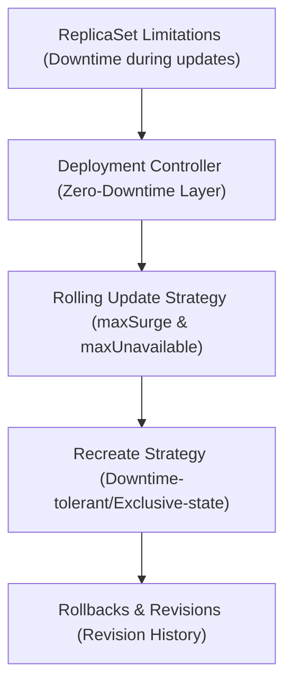

# Module 8-12: What is a Deployment

This module covers the Kubernetes Deployment controller, detailing how it extends the functionality of ReplicaSets to enable zero-downtime rolling updates and automated rollbacks.

---

## 🗺️ Cognitive Map: How to Think About the Flow of Knowledge

To build a strong intuition for this domain, think of the topics as moving from foundational primitives to advanced implementations:



1. **Step 1: The Transition (Section 1):** Moving from ReplicaSets to Deployments to resolve update-related downtime.
2. **Step 2: Architecture (Section 2):** Understanding how Deployments manage ReplicaSets on the developer's behalf.
3. **Step 3: Update Strategies (Section 3):** Comparing the default Rolling Update strategy with the Recreate strategy.
4. **Step 4: Rollbacks (Section 4):** Managing update failures through automated rollbacks and revision histories.

By following this flow, you progress from **Update Limitations → Controller Abstraction → Rollout Strategies → Rollback Mechanics**.

---

## 1. Limitations of ReplicaSets & the Need for Deployments

* **Downtime During Updates:** Pods are immutable. In a standalone ReplicaSet, updating a container image or configuration template requires deleting the old ReplicaSet and creating a new one, leading to application downtime.
* **The Solution:** The **Deployment** controller acts as a parent wrapper over ReplicaSets, managing updates, scaling, and self-healing to provide zero-downtime deployments.

---

## 2. Deployment Controller Architecture

A Deployment does not manage Pods directly. Instead, it manages one or more ReplicaSets, which in turn manage the Pods.
* **Delegated Execution:** Scaling and self-healing tasks are executed by the underlying ReplicaSet. The developer interacts with the Deployment, and the Deployment communicates with the ReplicaSet on the developer's behalf.
* **Direct Abstraction:** Deployments abstract the management of ReplicaSets, removing the need for developers to deploy or configure ReplicaSets directly.

---

## 3. Deployment Update Strategies

When a Deployment's pod template is modified, it triggers a rollout using one of the following strategies:

### A. Rolling Update Strategy (Default)
Enables updates with zero downtime by progressively replacing old Pods with new ones:
1. The Deployment spins up a new ReplicaSet based on the updated template.
2. It scales up the new ReplicaSet and scales down the old ReplicaSet incrementally.
3. The old ReplicaSet is kept at zero replicas for rollback purposes.

This behavior is controlled by two parameters:
* `maxSurge`: The maximum number of Pods that can be created above the desired replica count during the rollout. Default is `25%` (or `1` Pod).
* `maxUnavailable`: The maximum number of Pods that can be unavailable during the update process. Default is `25%` (or `1` Pod).

### B. Recreate Strategy
A simpler update strategy that does not guarantee zero downtime:
1. All existing Pods in the old ReplicaSet are terminated.
2. Once all old Pods are terminated, the new ReplicaSet creates the updated Pods.
* **Use Case:** Choose `Recreate` when the application cannot support running multiple versions concurrently (e.g., when sharing read-write storage with exclusive lock requirements).

---

## 4. Rollbacks and Revision Control

Deployments record update rollouts in a revision history.
* If a new version crashes during rollout (e.g., due to configuration errors or failed readiness probes), the rollout pauses.
* The developer can restore the application to a working version by rolling back:
  ```bash
  # Check the rollout status
  kubectl rollout status deployment/myapp

  # View rollout revision history
  kubectl rollout history deployment/myapp

  # Rollback to the previous version
  kubectl rollout undo deployment/myapp

  # Rollback to a specific revision
  kubectl rollout undo deployment/myapp --to-revision=2
  ```
