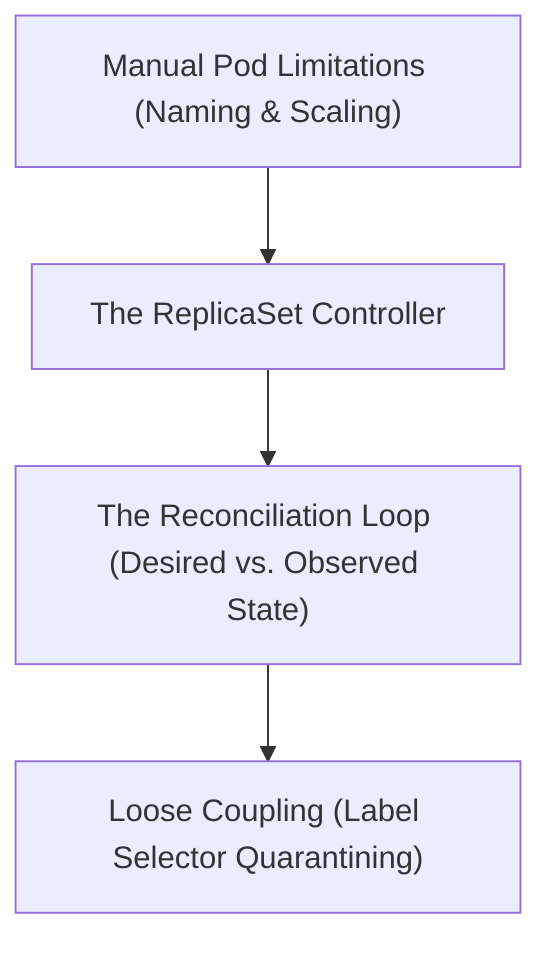

# Module 8-10: What is a ReplicaSet

This module covers the ReplicaSet controller, the reconciliation loop, and how label selectors dynamically bind ReplicaSets to Pods.

---

## 🗺️ Cognitive Map: How to Think About the Flow of Knowledge

To build a strong intuition for this domain, think of the topics as moving from foundational primitives to advanced implementations:

1. **Step 1: Manual Constraints (Section 1):** Identifying the limitations of creating and maintaining Pods manually.
2. **Step 2: Controller Loop (Section 2):** Explaining how the reconciliation loop matches actual Pod counts to desired counts.
3. **Step 3: Label Binding (Section 3):** Detailing how loose coupling via labels enables scaling and Pod quarantining.

By following this flow, you progress from **Manual Management → Automated Reconciliation → Loosely Coupled Groups**.

---

## 1. Limitations of Manual Pod Management

Creating Pods manually (outside of a controller) presents significant operational issues:
1. **Name Uniqueness:** Each Pod must have a unique name in its namespace.
2. **Manual Scaling:** Scaling out requires copy-pasting manifests, while scaling in requires manual deletion of specific Pods.
3. **Template Immutability:** Updating a container image or configuration requires manually deleting and recreating each Pod.

---

## 2. The ReplicaSet and the Reconciliation Loop

A **ReplicaSet** automates Pod management by ensuring a specified number of identical Pods are running at any given time.
* **Template-Based Creation:** The ReplicaSet uses a pod template defined in its spec to spin up identical Pod instances.
* **The Reconciliation Loop:** This is a continuous control loop that compares the **observed state** (the actual number of running Pods in the cluster) with the **desired state** (the replica count defined in the ReplicaSet manifest).
  * If the observed count is lower than desired, the controller requests the API server to create new Pods.
  * If the observed count is higher, the controller deletes extra Pods.

---

## 3. Loose Coupling via Labels and Quarantining

ReplicaSets are loosely coupled to their Pods, binding to them entirely through label selectors:
* **Selectors (`matchLabels`):** A ReplicaSet monitors and manages any Pod in its namespace that matches its defined label selector.
* **Dynamic Pod Quarantining:** If a Pod misbehaves in production, you can modify its labels at runtime. This disconnects the Pod from the ReplicaSet.
  * Because the observed replica count drops by one, the ReplicaSet's reconciliation loop immediately creates a new Pod to maintain the desired count.
  * The disconnected Pod remains running in isolation, allowing developers to connect shells or inspect logs to debug the issue without affecting live traffic.
