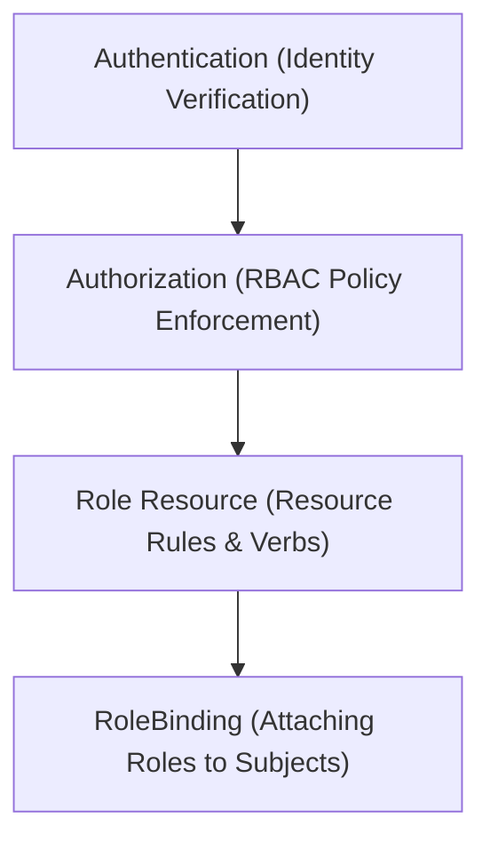

# Module 8-35: RBAC: What is a Role

This module covers Role-Based Access Control (RBAC) in Kubernetes, comparing authentication with authorization, and explaining Role and RoleBinding resources.

---

## 🗺️ Cognitive Map: How to Think About the Flow of Knowledge

To build a strong intuition for this domain, think of the topics as moving from foundational primitives to advanced implementations:



1. **Step 1: Security Concepts (Section 1):** Distinguishing authentication from authorization.
2. **Step 2: Role Specifications (Section 2):** Defining access rules, API groups, and allowed verbs.
3. **Step 3: Role Bindings (Section 3):** Attaching defined permissions to users, groups, or ServiceAccounts.

By following this flow, you progress from **Identity Verification → Permission Rules → Binding Actions**.

---

## 1. Authentication vs. Authorization

* **Authentication (AuthN):** Verifies the identity of the client sending the request (e.g., verifying TLS certificates, tokens, or Single Sign-On credentials).
* **Authorization (AuthZ):** Determines what actions the authenticated client is permitted to perform.
* **Default Security Policy:** Kubernetes operates on a zero-trust model. By default, authenticated users have zero authorizations and cannot access any cluster resources until configured.

---

## 2. Role Resource Specification

A **Role** defines namespaced permissions:
* **Scope:** Confined to a single namespace.
* **API Groups:** Rules specify the API group containing the resource (e.g., `""` for the core group, `"apps"` for deployments).
* **Verbs:** Explicitly list allowed actions (e.g., `get`, `list`, `watch`, `create`, `update`, `delete`).

```yaml
apiVersion: rbac.authorization.k8s.io/v1
kind: Role
metadata:
  namespace: default
  name: pod-reader
rules:
  - apiGroups: [""]  # Core group
    resources: ["pods"]
    verbs: ["get", "list", "watch"]
```

---

## 3. RoleBindings and Subjects

A **RoleBinding** associates a Role with one or more subjects:
* **Subjects:**
  * **User:** Human accounts.
  * **Group:** Collections of users.
  * **ServiceAccount:** Non-human accounts utilized by Pods or internal automation.
* **YAML Example:**
  ```yaml
  apiVersion: rbac.authorization.k8s.io/v1
  kind: RoleBinding
  metadata:
    name: read-pods
    namespace: default
  subjects:
    - kind: ServiceAccount
      name: my-service-account
      namespace: default
  roleRef:
    kind: Role
    name: pod-reader
    apiGroup: rbac.authorization.k8s.io
  ```
