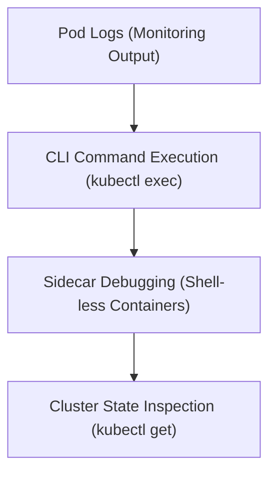

# Module 8-3: Working and Running a Pod

This module covers the practical steps for monitoring, inspecting, and executing commands inside running Pods using `kubectl`.

---

## 🗺️ Cognitive Map: How to Think About the Flow of Knowledge

To build a strong intuition for this domain, think of the topics as moving from foundational primitives to advanced implementations:



1. **Step 1: Logging (Section 1):** Learning how to stream and filter logs from single and multi-container Pods.
2. **Step 2: Command Execution (Section 2):** Executing interactive and non-interactive shell commands inside running containers.
3. **Step 3: Sidecar Debugging (Section 3):** Implementing sidecars to debug minimalist, shell-less application containers.
4. **Step 4: CLI Resources (Section 4):** Querying live resource information from the cluster.

By following this flow, you progress from **Application Output (Logs) → Direct Inspection (Exec) → Advanced Debugging → Cluster Discovery**.

---

## 1. Logging and Diagnostics

Monitoring application logs is essential for troubleshooting workloads.
* **Stream Logs:** To stream logs from a running Pod named `web`:
  ```bash
  kubectl logs -f web
  ```
* **Multi-Container Pods:** If a Pod runs multiple containers, specify the target container name with the `-c` flag:
  ```bash
  kubectl logs web -c container-name
  ```
* **Production Log Aggregation:** While `kubectl logs` is suitable for active troubleshooting, production clusters should deploy centralized logging systems (e.g., Elasticsearch/Fluentd/Kibana, Splunk, or Datadog) to aggregate and persist log streams.

---

## 2. Direct Container Execution

To inspect the runtime environment or debug config files, you can execute commands inside a container:
* **Run a single command:**
  ```bash
  kubectl exec -it web -- date
  ```
* **Open an interactive shell:**
  ```bash
  kubectl exec -it web -- bash
  ```

---

## 3. Debugging Shell-less Containers

Modern secure production containers (such as those running compiled Go binaries) are often built "distroless" or without shell environments (like `/bin/sh` or `/bin/bash`) to reduce the attack surface.
* **Debugging Approach:** Because you cannot run `kubectl exec` into a container without a shell, you can deploy a sidecar container in the same Pod. Since the containers share the same network namespace and emptyDir storage, the sidecar can analyze the main application's environment and shared filesystem.

---

## 4. Key Cluster Discovery Commands

Use these commands to discover active resources inside your cluster:
```bash
# Check the services active in the current namespace
kubectl get services

# Check all resources in the current namespace (pods, deployments, services, replicasets)
kubectl get all

# List all API resource types supported by the cluster API server
kubectl api-resources

# List worker and control plane nodes and check their status
kubectl get nodes

# Watch changes to all resources in real-time
kubectl get all -w

# Watch changes to pods in real-time
kubectl get pods -w
```
