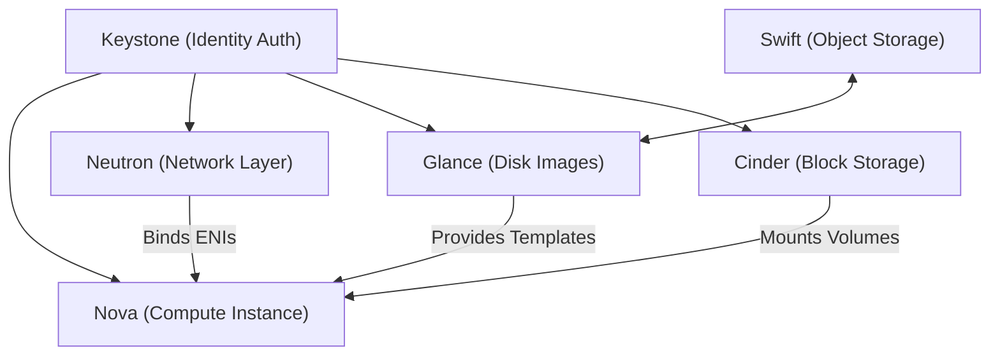

---
domains:
  - "cloud"
  - "virtualization"
  - "openstack"
---

# OpenStack Private Cloud Infrastructure

This module covers private cloud virtualization, comparisons with public hyperscalers, and the core service components required to construct an Infrastructure-as-a-Service (IaaS) cloud environment.

---

## 1. Private Cloud Virtualization vs. Public Hyperscalers

Enterprise organizations classify cloud computing architectures into distinct hosting paradigms based on ownership and security isolation boundaries:

*   **Hyperscalers:** Massive public cloud providers (e.g. Amazon Web Services (AWS), Google Cloud Platform (GCP), Microsoft Azure, Huawei Cloud) that manage globally distributed physical server farms, lease compute/storage resources multi-tenant, and deliver managed services via public API endpoints.
*   **Private Cloud:** On-premise virtualized compute clusters managed internally by an organization. It provides cloud-like resource scaling, automated provisioning, and tenant self-service API endpoints while maintaining absolute control over the physical hardware and security perimeter.
*   **OpenStack:** An open-source software integration suite designed to orchestrate bare-metal hardware pools, transforming them into a scalable, secure private Infrastructure-as-a-Service (IaaS) cloud.

---

## 2. Core Service Components of an IaaS Cloud

While the OpenStack project contains dozens of specialized sub-projects, a minimum of **six core services** is required to construct a basic operational cloud environment.



### The 6 Core OpenStack Engines

1.  **Keystone (Identity Service):**
    The central authentication and authorization gateway. Keystone manages users, projects (tenants), roles, API access credentials, and maintains the service directory endpoints mapping the cloud services.
2.  **Nova (Compute Service):**
    The virtualization engine. Nova coordinates hypervisor host resource allocations (KVM, QEMU, Xen) to provision, schedule, execute, and decommission virtual machine instances.
3.  **Glance (Image Service):**
    The template registry. Glance stores, catalogs, and retrieves virtual disk images (such as Raw, QCOW2, VMDK files) utilized as blueprints to boot new VM instances.
4.  **Neutron (Network Service):**
    The Software-Defined Networking (SDN) manager. Neutron configures virtual switches, subnets, routers, firewalls (security groups), and allocates floating IP addresses to instances.
5.  **Cinder (Block Storage Service):**
    Manages persistent block storage volumes. Cinder provisions storage targets that virtual machines mount as raw disks, ensuring data persists independently of the VM lifecycle.
6.  **Swift (Object Storage Service):**
    A highly available, distributed object storage platform. Swift stores unstructured data (such as raw backups, images, or configuration files) redundantly across clusters of storage nodes, utilizing an HTTP REST API interface.

---

## 3. Deployment Topology Considerations

#### Deep-Intuition (AARF) Breakdown: Hypervisor Allocation and Control Plane Separation
1.  **The Answer (Core Pattern):** Isolate the OpenStack control plane engines (Keystone, Neutron-server, Nova-scheduler) onto dedicated Controller Nodes, and configure compute hypervisors exclusively on dedicated Compute Nodes running KVM:
    ```
    Controller Nodes: Keystone API, Nova API, RabbitMQ Cluster, MySQL DB, Glance API
    Compute Nodes: Nova-compute agent, Libvirt/KVM, Open vSwitch agent
    ```
2.  **The Assumptions (Context):** The network switches must support VLAN trunking or VXLAN overlays to support Neutron software-defined networking isolation between tenant networks.
3.  **The Rationale (Why):** Separating the control plane prevents resource starvation. If a tenant VM experiences high CPU utilization, it only impacts its local compute hypervisor, leaving the central database and API scheduler responsive to manage other cluster resources.
4.  **The Failure Loop (What if not):** Deploying control plane services on compute nodes risks service drops. A high-load virtual machine can exhaust host memory, triggering the Linux kernel's Out-Of-Memory (OOM) killer to terminate database processes or message queues, causing the entire cloud control plane to crash.
5.  **Alternative Case (When to use 'if not'):** For proof-of-concept deployments or laboratory sandboxes containing fewer than 3 hosts, deploy an all-in-one single-node configuration using DevStack to simplify installation.

---

## 📖 Sources and References
*   NTI Cloud Computing Study Track.
