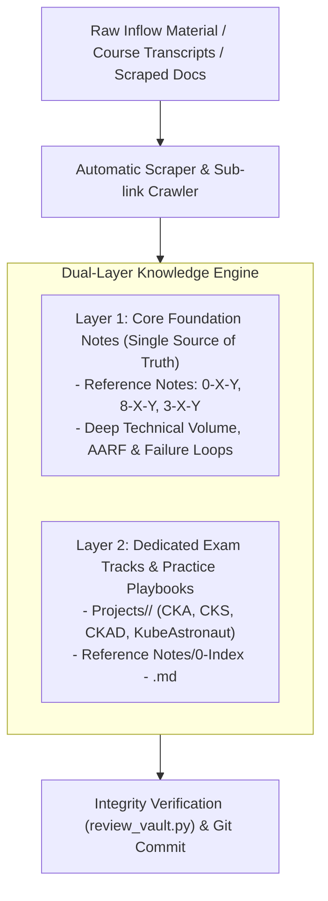

# Universal Multi-Domain Ingestion & Continuous Note Enrichment Workflow

This document defines the central orchestration schema for ingesting raw material (transcripts, course videos, documentation dumps, whitepapers) into the **Second Brain & Digital Garden** vault.

This workflow applies **universally across all technology domains** (Kubernetes/Cloud-Native, Linux/OS Engineering, Cloud AWS/Azure/GCP, Terraform, CI/CD, and Databases).

---

## 🏛️ Core Architectural Principle: The Dual-Layer Knowledge Engine

Every ingested technical resource (e.g. Mumshad's CKS course transcript, official K8s documentation, AWS whitepapers, Linux SysAdmin guides) feeds into a **Dual-Layer Knowledge Engine**:



### 1. **Layer 1: Core Foundation Notes (The Single Source of Truth)**
* **Location:** `Reference Notes/<Domain_Prefix>/` (e.g., `0-7-1`, `0-7-2` for Kubernetes, `8-X` for Linux, `3-X` for AWS).
* **Continuous Volume & Depth Enrichment:** When new materials are ingested, the core concept notes **MUST BE UPDATED FIRST**. Newly discovered CLI flags, kernel mechanisms, YAML fields, failure loops, and AARF (Answer, Assumptions, Rationale, Failure Loop, Alternative Case, Evolutionary Bridge) insights are appended directly into these Core Foundation Notes.
* **Result:** The Core Notes continuously gain diagnostic volume, technical depth, and longevity without duplicating theory across different notes.

### 2. **Layer 2: Dedicated Exam Tracks & Practice Playbooks**
* **Location:** `Projects/<CERT>/` (e.g. `Projects/CKS/`, `Projects/CKA/`, `Projects/CKAD/`) and `Reference Notes/0-Index - <CERT>.md`.
* **Concentrated Exam Synthesis:** When ingesting certification-specific materials (e.g., Mumshad's CKS course transcript), course Q&As, exam speed shortcuts, terminal aliases, and hands-on lab playbooks are compiled into the **Dedicated Exam Track**.
* **Cross-Linking:** The Exam Track notes synthesize the course knowledge **while directly linking and referencing the enriched Core Foundation Notes**, ensuring a concentrated, highly convenient study flow for certification exams (CKA, CKAD, CKS $\rightarrow$ **Golden KubeAstronaut Track**, AWS SAA/SAP, RHCSA/RHCE).

---

## ⚙️ Phase-by-Phase Ingestion Protocol

Whenever the `@ingest inflow/<filename>.md` trigger is called:

### **Phase 0: Automatic Scraping & Sub-Link Crawling**
1. **Scrape External Documentation:** Execute `python3 "Reference Notes/scripts/scrape_docs.py" inflow/<filename>.md`.
2. **Sub-Link Resolution:** Crawl and append key sub-links and diagrams under `## 🌐 Scraped Reference Content`.
3. **Arabic Transcripts:** Translate technical summaries to English while preserving technical keywords and source links.

### **Phase 1: Core Foundation Refinement & Volume Expansion**
* **Agent:** `ResearchAgent` (`System/Agents/researcher.md`)
* **Task:** Extract raw notes, configurations, and concepts. **Update existing Core Reference Notes** (e.g., `0-7-2_pod_security_standards`) or create modular `0-X-Y` sub-notes if a new sub-domain is introduced. Apply AARF documentation formatting.

### **Phase 2: Context Auditing & Evolutionary Bridging**
* **Agent:** `AuditAgent` (`System/Agents/auditor.md`)
* **Task:** Audit the updated Core Notes for missing system parameters, SELinux/kernel hooks, or edge cases. Include **Evolutionary Bridges** (e.g. legacy UNIX/AWS mechanics vs modern Linux/Cloud APIs) when historical content is present.

### **Phase 2.5: Diagram Design**
* **Agent:** `DiagramAgent` (`System/Agents/diagrammer.md`)
* **Task:** Insert valid Mermaid.js diagrams for complex architectural flows, packet routing, or lifecycle state transitions.

### **Phase 3: Contextual Proof of Concept Integration (In-Note PoCs)**
* **Agent:** `MultiDomainPoCAgent` (`System/Agents/poc_developer.md`)
* **Task:** Embed practical Proof of Concept configurations, declarative manifests (YAML, HCL, Dockerfile), diagnostic CLI recipes, and negative failure-loop simulations directly within the explanation context of the target Reference Note. **No standalone project files are automatically generated in `Projects/`**; the `Projects/` directory is strictly reserved for manual user organization and collaborative project playbooks co-authored *together with the user*.

### **Phase 4: Digital Garden Pattern Mapping**
* **Agent:** `GardenAgent` (`System/Agents/garden_architect.md`)
* **Task:** Map cross-domain intersections (e.g. Kubernetes + AWS IRSA + Linux cgroups) in `Digital Garden/`.

### **Phase 5: Concept Atomic Landing & Deeper Dive Notes**
* **Task:** Create or update atomic landing and deeper-dive notes inside `Main Notes/` ensuring full cross-linking.

### **Phase 6: Dedicated Exam Track & Certification Synthesis**
* **Agent:** `ExamAgent` (`System/Agents/exam_expert.md`)
* **Task:** If the material targets a certification path (CKA, CKS, CKAD, KubeAstronaut, AWS SAA/SAP, Red Hat RHCSA, Azure AZ-104/305), compile exam speed shortcuts, diagnostic aliases, and Q&A checklists into dedicated exam tracks (`Reference Notes/0-Index - <CERT>.md` and `Projects/<CERT>/`), linking directly to the enriched Core Notes.

### **Phase 7: Verification, Backlog Logging & Git Synchronization**
1. Run `python3 "Reference Notes/scripts/review_vault.py"` to ensure 100% link integrity.
2. Record the transaction in `backlog.md`.
3. Stage, commit, and push to GitHub:
   ```bash
   git add .
   git commit -m "docs/feat: ingest <topic> and update core/exam notes"
   git push origin main
   ```

---

## 🌐 Universal Multi-Tech Matrix

| Domain Prefix | Tech Domain | Core Foundation Notes (Layer 1) | Dedicated Exam / Track Overlays (Layer 2) |
| :---: | :--- | :--- | :--- |
| `0-X` | **Kubernetes & Cloud-Native** | `Reference Notes/0-X-Y_...` | CKA, CKAD, CKS, KCNA $\rightarrow$ **Golden KubeAstronaut** |
| `1-X` | **Systems Design & Architecture** | `Reference Notes/1-X_...` | Distributed Systems, Scalability, Sharding, Microservices |
| `2-X` | **Docker & Container Runtimes** | `Reference Notes/2-X_...` | DCA (Docker Certified Associate), Containerd, OCI |
| `3-X` | **AWS Cloud Architecture** | `Reference Notes/3-X_...` | AWS Solutions Architect (SAA-C03, SAP-C02), Security |
| `4-X` | **BGP & Advanced Routing** | `Reference Notes/4-X_...` | BGP Peering, Route Reflectors, Datacenter Fabrics |
| `5-X` | **Jenkins CI/CD Automation** | `Reference Notes/5-X_...` | Jenkins Distributed Pipelines, Automated Testing |
| `6-X` | **Web Fundamentals & UI** | `Reference Notes/6-X_...` | HTML5 Semantics, CSS Box Model, Web Standards |
| `7-X` | **Python Programming** | `Reference Notes/7-X_...` | Python Core, Virtualenvs, Flask API Services |
| `8-X` | **Linux OS & Kernel Internals** | `Reference Notes/8-X_...` | RHCSA, RHCE, Linux Kernel & System Administration |
| `9-X` | **GitHub Actions Automation** | `Reference Notes/9-X_...` | GitHub Actions Workflows, CI/CD, Passwordless OIDC |
| `10-X` | **Terraform & Infrastructure as Code** | `Reference Notes/10-X_...` | HashiCorp Terraform Associate, EKS GitOps Playbooks |
| `11-X` | **AWS CloudOps & Reliability** | `Reference Notes/11-X_...` | AWS SysOps Administrator, SSM Automation, CloudWatch |
| `12-X` | **CNCF Cloud-Native Patterns** | `Reference Notes/12-X_...` | Cloud-Native Digests, Architecture Patterns, etcd/CSI |
| `13-X` | **Microsoft Azure Architecture** | `Reference Notes/13-X_...` | Azure Fundamentals (AZ-900), Administrator (AZ-104), Architect (AZ-305) |
| `MISC` | **Miscellaneous Multi-Domain Projects**| `Reference Notes/gitea_...`, etc. | Self-Hosted GitOps, OpenStack, Hybrid Troubleshooting |

