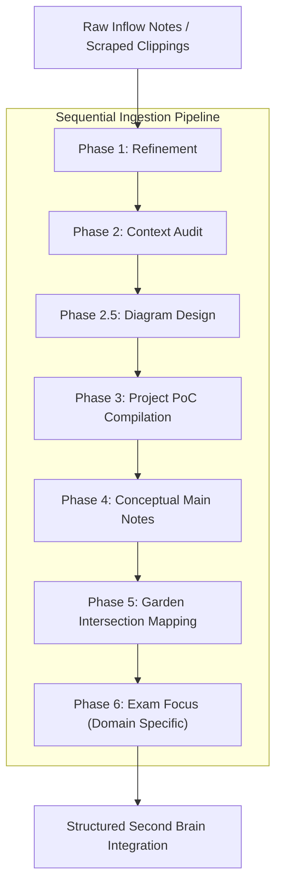

# Second Brain & Digital Garden Ingestion Workflow

This file serves as the central orchestration schema and documentation for the multi-agent ingestion pipeline. When new technical clipping files, transcripts, or URL indexes are introduced to the `inflow/` directory, they are processed sequentially through this pipeline.

---

## 🏛️ Ingestion Pipeline Orchestration Map

The ingestion process is divided into 6 distinct, sequential phases. Each phase is executed by a specialized agent utilizing a dedicated skill instruction file.



---

## ⚙️ Detailed Ingestion Phases

### Phase 1: Refinement
- **Orchestrated Agent:** **ResearchAgent** (`System/Agents/researcher.md`)
- **Governing Skill:** `System/Skills/ingest_refinement.md`
- **Output:** Refines raw chat scripts or scraped HTML files in `inflow/` by removing fluff, system errors, and redundancy, and writes a detailed, high-verbosity module inside `Reference Notes/`.

### Phase 2: Context Auditing & Expansion
- **Orchestrated Agent:** **AuditAgent** (`System/Agents/auditor.md`)
- **Governing Skill:** `System/Skills/context_audit.md`
- **Output:** Audits the refined Reference Note to identify tangent or secondary system concepts (e.g. Linux kernel hooks, reverse proxy parameters, security layers) and adds explanatory background volume to ensure the notes are self-contained.

### Phase 2.5: Diagram Design & Visual Elaboration
- **Orchestrated Agent:** **DiagramAgent** (`System/Agents/diagrammer.md`)
- **Governing Skill:** `System/Skills/diagram_generation.md`
- **Output:** Identifies complex flows, topologies, states, or timelines in the notes and inserts standard-compliant, beautiful Mermaid.js diagrams directly into the Markdown documents.

### Phase 3: Project-Based PoC Compilation
- **Orchestrated Agent:** **MultiDomainPoCAgent** (`System/Agents/poc_developer.md`)
- **Governing Skill:** `System/Skills/project_poc.md`
- **Output:** Takes hands-on implementation scripts, configurations (e.g., Nginx, Docker, Terraform), and CLI validation recipes, and packages them as a standalone project note inside the `Projects/` folder (e.g., `Projects/Systems Design/`), referencing the core Second Brain concepts. Pointers are added to the Reference/Main notes to link them.

### Phase 4: Main Notes (Conceptual Atomicity)
- **Orchestrated Agent:** **IntegrationAgent** (Main Session)
- **Governing Skill:** `System/Templates/landing_note.md` & `System/Templates/deeper_note.md`
- **Output:** Creates or updates atomic **Landing Notes** (one per core concept) and **Deeper-dive Notes** (sub-topics/pitfalls) in `Main Notes/`. Populates frontmatter properties (`domains`, `related_concepts`, `against`) and breadcrumbs.

### Phase 5: Digital Garden Integration
- **Orchestrated Agent:** **GardenAgent** (`System/Agents/garden_architect.md`)
- **Governing Skill:** `System/Skills/garden_linking.md`
- **Output:** Maps intersections between multiple domains and compiles connective **Architectural Pattern Notes** in `Digital Garden/`, referencing the core concepts and implementation projects.

### Phase 6: Exam Focus & checklists
- **Orchestrated Agent:** **CKAExamAgent** (`System/Agents/exam_expert.md`)
- **Governing Skill:** `System/Skills/exam_checklists.md`
- **Output:** If the ingested topic is relevant to an active certification track (e.g., CKA, AWS Solution Architect), compiles exam-specific checklists, alias shortcuts, VIM settings, and speed-run playbooks in the respective project subfolder (e.g., `Projects/CKA/`).

---

## 📈 Git Synchronization & Backlog Logging
At the end of every successful ingestion transaction:
1. Run `Reference Notes/scripts/review_vault.py` to audit formatting and verify that 100% of wiki links are resolved.
2. Record the transaction detailing added/modified files in the root `backlog.md` file.
3. Execute Git synchronization:
   ```bash
   git add .
   git commit -m "docs/feat: ingest <topic> and integrate conceptual/project notes"
   git push origin main
   ```
